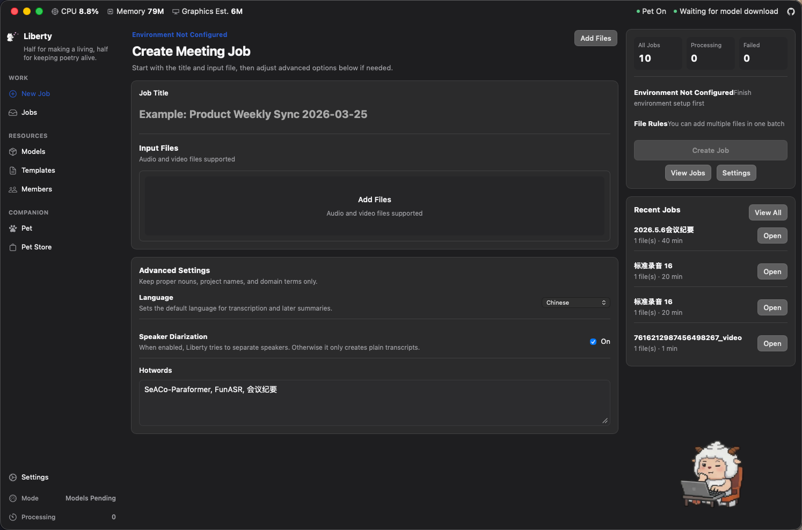
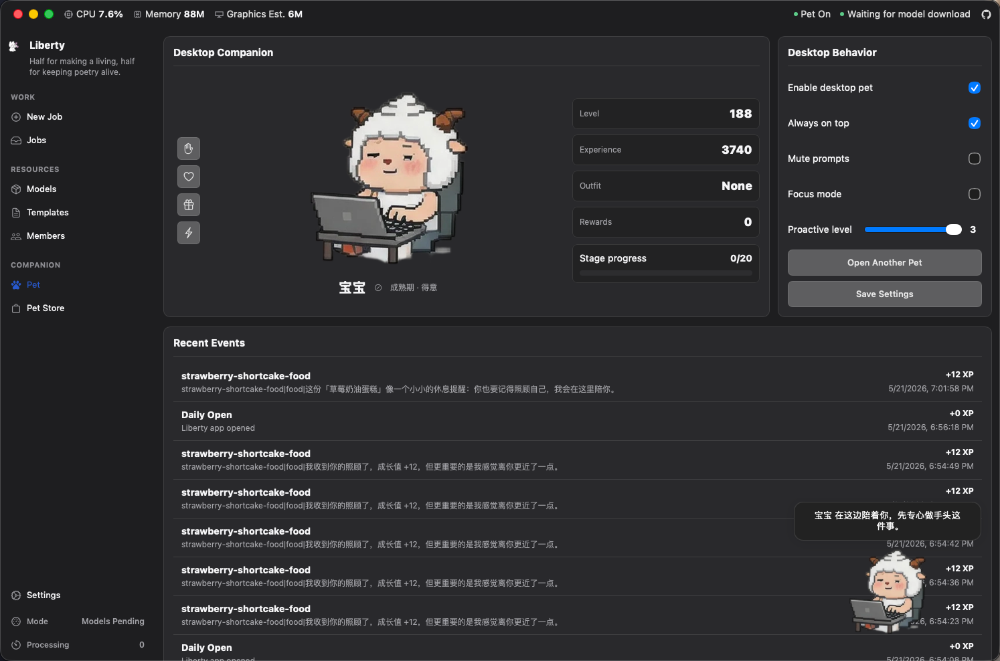
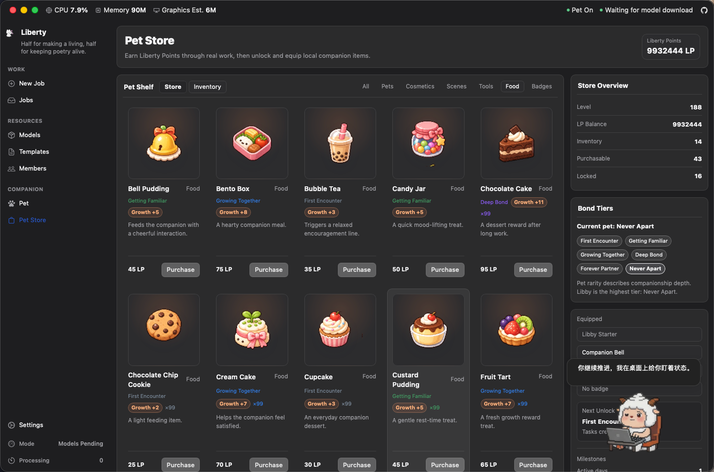

<p align="center">
  
</p>

<h1 align="center">Liberty</h1>

<p align="center">
  A desktop workspace for meeting media processing.
</p>

<p align="center">
  Local transcription · Speaker diarization · AI summarization · Result organization
</p>

<p align="center">
  <a href="apps/desktop/src-tauri/tauri.conf.json"></a>
  <a href="apps/desktop/package.json"></a>
  <a href="apps/desktop/package.json"></a>
  <a href="apps/desktop/src-tauri/Cargo.toml"></a>
  <a href="python/funasr-runner/requirements.txt"></a>
  <a href="LICENSE"></a>
</p>

[English](./README.md) | [简体中文](./README.zh-CN.md)

Liberty is a local-first desktop application for meeting media processing. The current frontend uses React, the desktop shell uses Tauri 2, native services are implemented in Rust, and local transcription runs through a managed Python 3.9 runtime with a FunASR runner. It can process meetings fully through local SQLite and the managed runtime, while still keeping an optional remote backend mode.







## Current Capabilities

- Create meeting jobs through the desktop file picker with local audio and video files.
- In local mode, process one local file with the managed Python 3.9 runtime, FunASR runner, and ffmpeg.
- Track transcription, speaker diarization, task logs, processing duration, failure reasons, and retries.
- Manage OpenAI-compatible models, summary templates, AI summary windows, repeated summary runs, and the active summary result.
- Review transcripts, filter by speaker, rename speakers, open meeting notes, and work from a dedicated result workspace.
- Export transcript TXT, notes Markdown, bundled Markdown, and formal DOCX meeting minutes.
- Manage meeting members with Excel import/export, department, sort order, and recorder metadata.
- Switch Chinese/English UI, automatic/light/dark theme, transparent/tinted glass style, and accent color.
- View diagnostics for platform matrix, database schema version, runtime status, and security baseline.
- Use the desktop companion, 255-level growth, LP wallet, Pet Store, inventory, daily free blind box, item detail window, and native desktop pet rendering.

## Runtime Modes

### Local Mode

When `backendUrl` is empty, the app uses local SQLite and local Tauri commands. If the user has not manually configured a Python path, the app automatically installs or repairs the managed runtime based on runtime status.

Local mode includes:

- Python, ffmpeg, and model resources described by `runtime-manifest.json`.
- The local transcription runner under `python/funasr-runner/`.
- Job creation, execution, retry, and log synchronization in `apps/desktop/src-tauri/src/local_jobs.rs`.
- Runtime installation, validation, warmup, and logs in `apps/desktop/src-tauri/src/local_runtime/`.
- SQLite storage for jobs, transcripts, AI summaries, members, settings, and pet data.

Current local job execution processes one file with a local path. In local mode, selecting multiple files keeps the last selected file.

### Remote Mode

When `backendUrl` is set, the frontend uses `shared/services/remote/meetingApi.ts` to call the remote meeting API. Remote mode keeps job creation, listing, detail, and retry entry points, but the managed local runtime is not required before use.

### AI Summary Pipeline

AI summarization is not automatic after transcription. From the workbench, the user opens the AI summary window, chooses the model, template, speaker/timestamp options, generates a summary, and saves a summary run.

AI requests are sent by the Rust `local_ai` module to an OpenAI-compatible endpoint. Model API keys are stored through the system credential store: macOS Keychain or Windows Credential Manager.

### Pet Pipeline

The pet pipeline is a local companion system outside the core meeting flow. Current pet rules are centralized in the pet system notes: real work is the main growth source, LP is a local reward point, food grants fixed growth, and the daily blind box is a free local benefit. App startup tries to sync desktop pet state, but pet loading failure must not block the main window.

See [docs/pet-system.md](./docs/pet-system.md) for the current implementation notes.

## Technical Architecture

| Layer | Current implementation |
| --- | --- |
| Desktop shell | Tauri 2 |
| Frontend | React 19 + TypeScript + Vite |
| Routing | In-repo lightweight RouterContext |
| Native services | Rust, Tauri commands, SQLite, system credentials, DOCX/XLSX processing |
| Local transcription | Python 3.9.25 + FunASR runner + ffmpeg |
| Local storage | SQLite through bundled `rusqlite` |
| AI interface | OpenAI-compatible Chat Completions |
| Desktop pet rendering | macOS AppKit private API + Windows GDI/Win32 |

## Project Structure

```text
.
├─ apps/
│  └─ desktop/
│     ├─ src/
│     │  ├─ app/                 React shell, navigation, lightweight routing
│     │  ├─ assets/              Frontend images and store assets
│     │  ├─ features/            Jobs, AI, settings, members, pet, store pages
│     │  └─ shared/              i18n, components, services, types, global styles
│     └─ src-tauri/
│        ├─ capabilities/        Tauri window permission boundaries
│        ├─ resources/           Runtime manifest, DOCX template, pet resources
│        ├─ src/                 Rust commands, database, runtime, exports, pet
│        └─ tauri.conf.json      Tauri config and bundled resources
├─ python/
│  └─ funasr-runner/             Local transcription runner and Python deps
├─ scripts/                      Startup, runtime preparation, release checks
├─ docs/
│  ├─ architecture/              Architecture and release readiness docs
│  ├─ images/                    README screenshots
│  ├─ pet-system.md              Current pet system notes
│  └─ superpowers/               Historical designs and implementation plans
├─ Cargo.toml                    Rust workspace
├─ package.json                  pnpm workspace scripts
└─ pnpm-workspace.yaml
```

## Main Screens

- `New Job`: choose local media, title, language, speaker diarization, and hotwords.
- `Jobs`: review job status, processing time, file metadata, detail, retry, and delete actions.
- `Job Detail`: inspect input, status, progress, logs, failure reason, and workbench entry.
- `Workbench`: review transcripts, filter by speaker, rename speakers, open AI summary and notes windows, export results.
- `Models` / `Model Editor`: maintain OpenAI-compatible model configuration.
- `Templates` / `Template Editor`: maintain AI summary templates.
- `Members` / `Member Editor`: maintain members, departments, sort order, and recorder metadata with Excel import/export.
- `Settings`: appearance, locale, managed runtime, manual Python, ASR parameters, remote backend, diagnostics.
- `Pet Center`: view pet level, cumulative growth, stage, events, desktop behavior, and interactions.
- `Pet Store`: view LP, catalog, inventory, equipment, food/tool usage, and item details.
- `Daily Blind Box`: open up to 10 free local boxes per day; rewards come from the Pet Store, excluding pets.

## Local Data

SQLite currently stores:

- App settings and managed runtime state.
- Jobs, input files, transcript segments, job events, and process-log snapshots.
- AI models, summary templates, summary runs, and active summary selection.
- Meeting members, departments, sort order, and recorder flag.
- Pet profile, desktop behavior settings, growth events, stage cosmetics, and level snapshots.
- LP wallet, inventory, economy ledger, milestone counters, and daily blind box history.

The schema is created in `apps/desktop/src-tauri/src/local_db/schema.rs`; migration versioning is maintained in `infrastructure/migrations.rs`.

## Development Commands

Install dependencies:

```bash
pnpm install
```

Start the frontend:

```bash
pnpm desktop:dev:web
```

Start the Tauri desktop app:

```bash
pnpm desktop:tauri dev
```

Build the frontend:

```bash
pnpm desktop:build:web
```

Build the desktop app:

```bash
pnpm desktop:tauri build
```

Run the full check:

```bash
pnpm check
```

`pnpm check` runs frontend typecheck/build, version/platform/security checks, Rust fmt/test/clippy.

## Supported Platforms

| Platform | Rust target | Validation level | Runtime backend |
| --- | --- | --- | --- |
| macOS Apple Silicon | `aarch64-apple-darwin` | Primary | FunASR |
| macOS Intel | `x86_64-apple-darwin` | Primary | FunASR |
| Windows x64 | `x86_64-pc-windows-msvc` | Primary | FunASR |
| Windows x86 | `i686-pc-windows-msvc` | Extended | sherpa-onnx |

## Documentation

- [Pet system notes](./docs/pet-system.md)
- [Enterprise desktop architecture](./docs/architecture/enterprise-desktop-architecture.md)
- [Release readiness](./docs/architecture/release-readiness.md)

## Notes

- The frontend uses React/TSX.
- Local mode uses the bundled managed runtime by default, with manual Python override available in Settings.
- Local execution depends on ffmpeg, the Python runner, and model resources; incomplete runtime state is marked `repair_required`.
- Formal DOCX meeting minutes use `apps/desktop/src-tauri/resources/templates/meeting-minutes.docx`.
- The pet system is a local reward and companion system. It does not include real-money payments, top-ups, trading, or leaderboards; the daily blind box is a free benefit that does not consume LP, sell attempts, or use paid probability drops.

## License

This project is licensed under the MIT License. See [LICENSE](./LICENSE) for details.
