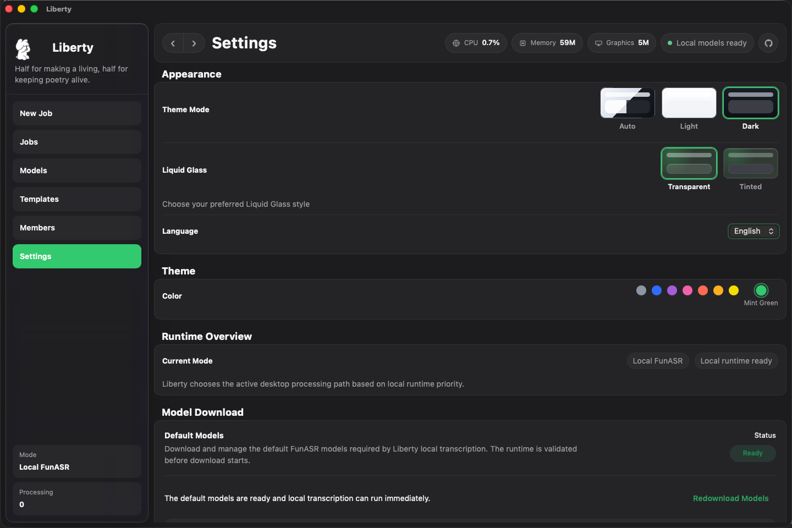
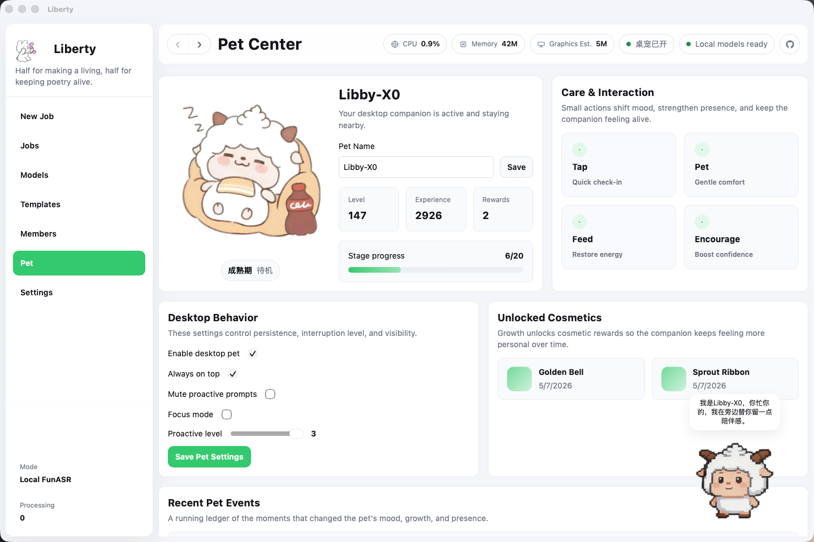

<p align="center">
  
</p>

<h1 align="center">Liberty</h1>

<p align="center">
  A desktop workspace for meeting media processing.
</p>

<p align="center">
  Local transcription · Speaker diarization · AI summarization · Result organization
</p>

<p align="center">
  <a href="apps/desktop/src-tauri/tauri.conf.json"></a>
  <a href="apps/desktop/package.json"></a>
  <a href="apps/desktop/package.json"></a>
  <a href="apps/desktop/src-tauri/Cargo.toml"></a>
  <a href="python/funasr-runner/requirements.txt"></a>
  <a href="LICENSE"></a>
</p>

[English](./README.md) | [简体中文](./README.zh-CN.md)

Liberty is a desktop workspace for meeting media processing, designed around a complete pipeline of local transcription, AI summarization, and result organization. The project is built with Tauri 2, Vue 3, TypeScript, Rust, and Python, with a strong focus on local execution, native desktop workflows, and centralized configuration.





## Overview

Liberty turns raw meeting audio or video files into structured, reviewable output:

- Import local meeting files through the native desktop file picker
- Run local transcription and speaker diarization with FunASR
- Track processing progress, logs, and failures inside the desktop app
- Generate AI summaries using user-configured online models
- Review transcripts, speaker labels, notes, and exports in a dedicated workspace

Liberty is not just a transcription utility. It is a desktop-first workflow tool for managing tasks, packaging the local runtime, and preserving outputs for later review and refinement.

## Core Capabilities

### 1. Local Meeting File Processing

- Import local audio and video files
- Supported formats: `m4a`, `mp3`, `wav`, `aac`, `flac`, `mp4`, `mov`, `mkv`
- Automatically preprocess media with `ffmpeg` before transcription
- Track task state, processing duration, logs, and results end to end

### 2. Local Transcription and Speaker Diarization

- Python 3.9 + FunASR based local transcription pipeline
- Optional speaker diarization
- Configurable local runtime parameters including device, thread count, and batch duration
- Managed runtime installed under the user application data directory, without relying on a system Python installation or administrator privileges

### 3. AI Summarization

- AI summarization is explicitly user-triggered, not automatic
- Built-in model management and template management
- Compatible with standard OpenAI-style API interfaces
- Stores multiple summary runs and allows switching the active result

### 4. Desktop Workflow

- New task creation
- Task list and task details
- Result workbench
- Meeting notes window
- AI summary window
- Settings, managed local runtime, model management, and template management

## Operating Modes

Liberty currently includes two primary processing layers:

### Local Runtime Pipeline

Used for desktop-side offline media processing.

It includes:

- Managed Python 3.9 runtime
- Python dependencies
- Default FunASR models
- `ffmpeg`
- Rust-side task scheduling and SQLite persistence

Before using local transcription for the first time, install the managed runtime from `Settings -> Local Runtime`.

### AI Summary Pipeline

Used to generate structured meeting output from transcription results.

It includes:

- Online model configuration
- Template configuration
- Prompt assembly
- Persistent summary run storage

AI summarization is independent from the local transcription pipeline and is always initiated by the user.

## Technical Architecture

| Layer | Technology |
| --- | --- |
| Desktop shell | Tauri 2 |
| Frontend UI | Vue 3 + Vue Router + TypeScript + Vite |
| Native/local services | Rust |
| Local transcription | Python 3.9 + FunASR |
| Local storage | SQLite |
| AI interface | OpenAI-compatible API |

### Repository Boundaries

- `apps/desktop/`: the Tauri desktop application, including Vue UI and Rust native commands
- `apps/desktop/src/features/`: user-facing domains such as jobs, AI summary, settings, members, templates, and pet
- `apps/desktop/src/shared/`: reusable UI components, types, localization, styles, and client services
- `apps/desktop/src-tauri/src/`: SQLite persistence, task execution, runtime installation, update handling, and native integrations
- `python/funasr-runner/`: the Python transcription runner, runtime validation, warmup, and dependency manifest
- `scripts/`: repository automation for Tauri startup, runtime bundle preparation, and release metadata

## Supported Platforms

- macOS Intel
- macOS Apple Silicon
- Windows x64

## Development Requirements

- Node.js 20+
- `pnpm`
- Rust stable
- Tauri CLI

## Local Development

Install dependencies:

```bash
pnpm install
```

Start the frontend development server:

```bash
pnpm desktop:dev:web
```

Start the desktop application in development mode:

```bash
pnpm desktop:tauri dev
```

Notes:

- Frontend changes typically hot reload
- Rust code, Tauri configuration, and bundled script/resource changes usually require restarting `pnpm desktop:tauri dev`

## Build

Build the frontend:

```bash
pnpm desktop:build:web
```

Build the desktop application:

```bash
pnpm desktop:tauri build
```

## Managed Local Runtime

The managed local runtime is installed and maintained by the application itself so end users can run local transcription without setting up a development environment.

The installation includes:

- Python 3.9 runtime
- Python dependencies
- Default FunASR models
- `ffmpeg`

Installation locations:

- macOS: `~/Library/Application Support/com.westng.liberty/runtime/`
- Windows: `%LOCALAPPDATA%\\com.westng.liberty\\runtime\\`

Design goals:

- Do not modify or depend on the system Python installation
- Do not require administrator privileges
- Allow download, reinstall, and log-based troubleshooting directly inside the app

## Project Structure

```text
.
├─ apps/
│  └─ desktop/
│     ├─ src/
│     │  ├─ app/                 App shell and router
│     │  ├─ assets/              Static assets
│     │  ├─ features/            Feature modules and views
│     │  └─ shared/              Components, types, i18n, styles, services
│     └─ src-tauri/
│        ├─ resources/           Runtime manifests and bundled resources
│        ├─ src/                 Rust native modules and Tauri commands
│        └─ tauri.conf.json      Tauri configuration
├─ python/
│  └─ funasr-runner/
│     ├─ runner.py              Local transcription runner
│     ├─ runtime_warmup.py      Default model warmup
│     ├─ runtime_validate.py    Python runtime validation
│     └─ requirements.txt       Runtime Python dependencies
├─ scripts/
│  ├─ run-tauri.mjs             Desktop startup wrapper
│  ├─ start-dev-server.mjs      Vite startup wrapper
│  └─ prepare-runtime-bundle.mjs
├─ packages/
│  └─ shared-types/             Reserved package boundary for generated/shared contracts
├─ crates/                      Reserved Rust workspace boundary for extracted reusable crates
├─ Cargo.toml                   Rust workspace
├─ pnpm-workspace.yaml          pnpm workspace
└─ README.md
```

## Main Screens and Modules

- `New Task`: import media files and configure a processing job
- `Task List`: review task status, processing time, and actions
- `Task Detail`: inspect input files, task settings, progress, and processing logs
- `Workbench`: review transcript, speakers, AI summaries, and export options
- `Model Management`: maintain reusable online model configurations
- `Template Management`: maintain AI summary templates
- `Settings`: theme, localization, local runtime parameters, and managed runtime installation

## Persistence and Outputs

Liberty uses SQLite for local persistence. The database currently stores:

- Task metadata
- Input file records
- Transcript and speaker segments
- Task processing logs
- AI summary runs
- Model and template configurations

This allows results to remain available across application restarts.

## Notes

- The current local FunASR pipeline operates on a single input file per task
- Some logs come directly from underlying dependencies such as FunASR, ModelScope, or jieba
- Media files with damaged frames or malformed headers may still produce `ffmpeg` warnings without preventing successful transcription
- AI summarization depends on user-provided online model configuration
- Desktop update publishing and CI details are documented in [docs/desktop-update-release.md](/Volumes/NQJL/每日博士/开发项目/Liberty/docs/desktop-update-release.md)

## License

This project is licensed under the MIT License. See [LICENSE](./LICENSE) for details.
