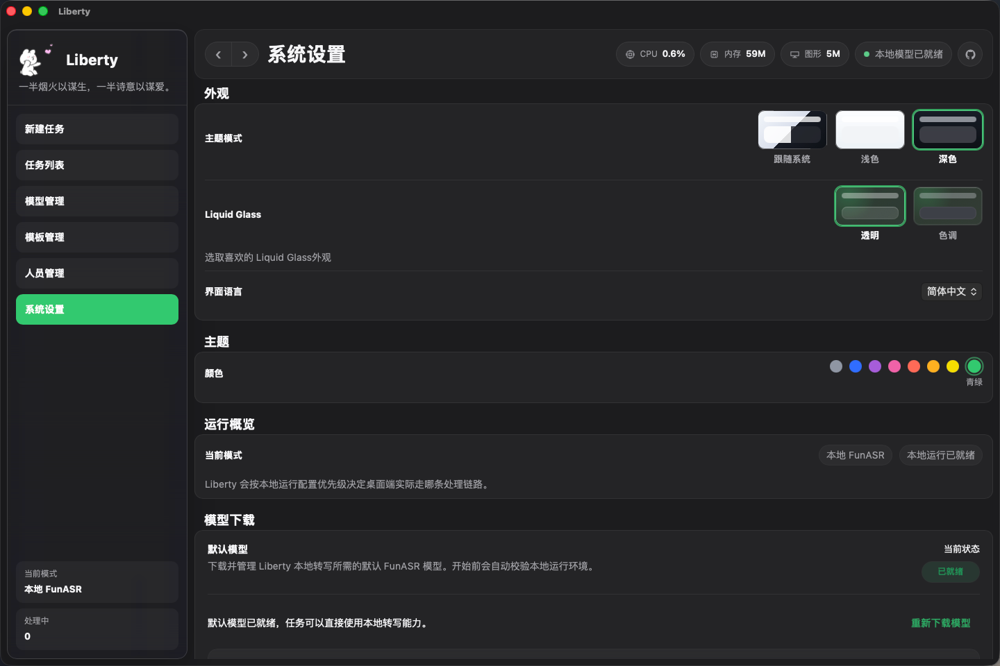
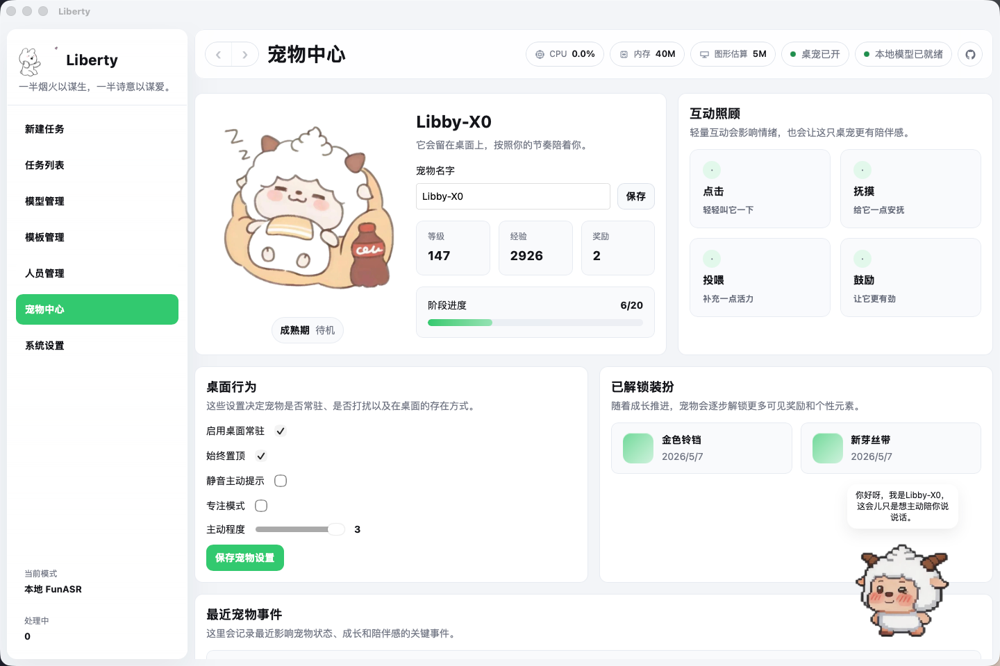

<p align="center">
  
</p>

<h1 align="center">Liberty</h1>

<p align="center">
  面向桌面端的会议音视频处理工作台。
</p>

<p align="center">
  本地转写 · 说话人分离 · AI 总结 · 结果整理
</p>

<p align="center">
  <a href="apps/desktop/src-tauri/tauri.conf.json"></a>
  <a href="apps/desktop/package.json"></a>
  <a href="apps/desktop/package.json"></a>
  <a href="apps/desktop/src-tauri/Cargo.toml"></a>
  <a href="python/funasr-runner/requirements.txt"></a>
  <a href="LICENSE"></a>
</p>

[English](./README.md) | [简体中文](./README.zh-CN.md)

Liberty 是一款面向桌面端的会议音视频处理工作台，围绕“本地转写、AI 总结、结果整理”这一完整链路设计。项目基于 Tauri 2、Vue 3、TypeScript、Rust 与 Python 构建，重点强调本地可运行、桌面端工作流完整以及配置集中管理。





## 项目概述

Liberty 用于将原始会议音视频文件转换为结构化、可审阅、可导出的结果：

- 通过桌面原生文件选择器导入本地会议文件
- 使用本地 FunASR 运行环境完成转写与说话人分离
- 在桌面应用内查看处理进度、处理日志与错误信息
- 基于用户配置的在线模型生成 AI 总结
- 在专用结果工作台中整理逐字稿、讲话人、纪要与导出内容

Liberty 不只是一个转写工具，它更像是一套桌面端会议内容处理工作流，用于管理任务、封装本地运行环境，并沉淀可持续复用的结果。

## 核心能力

### 1. 本地会议文件处理

- 支持导入本地音频与视频文件
- 支持格式：`m4a`、`mp3`、`wav`、`aac`、`flac`、`mp4`、`mov`、`mkv`
- 自动通过 `ffmpeg` 对媒体进行预处理，再进入转写链路
- 支持记录任务状态、处理时长、日志与最终结果

### 2. 本地转写与说话人分离

- 使用 Python 3.9 + FunASR 构建本地转写链路
- 支持说话人分离开关
- 支持配置本地运行参数，包括设备、线程数和批处理时长
- 本地运行环境安装在用户应用数据目录下，不依赖系统 Python，也不要求管理员权限

### 3. AI 总结

- AI 总结由用户手动触发，不自动执行
- 内置模型管理与模板管理
- 兼容 OpenAI 标准接口格式
- 支持保存多次总结结果，并切换当前展示结果

### 4. 桌面端工作流

- 新建任务
- 任务列表
- 任务详情
- 结果工作台
- 会议纪要窗口
- AI 总结窗口
- 系统设置、本地运行环境、模型管理、模板管理

## 运行模式

Liberty 当前主要包含两条处理链路：

### 本地运行链路

用于桌面端离线处理会议媒体文件。

包含内容：

- 托管 Python 3.9 运行时
- Python 依赖
- 默认 FunASR 模型
- `ffmpeg`
- Rust 侧任务调度与 SQLite 持久化

首次使用本地转写前，需要在 `系统设置 -> 本地运行环境` 中执行“下载并安装”。

### AI 总结链路

用于在转写结果基础上生成结构化会议内容。

包含内容：

- 在线模型配置
- 模板配置
- Prompt 组装
- 总结记录持久化

AI 总结与本地转写相互独立，由用户在需要时主动触发。

## 技术架构

| 层级 | 技术 |
| --- | --- |
| 桌面壳 | Tauri 2 |
| 前端界面 | Vue 3 + Vue Router + TypeScript + Vite |
| 本地能力 | Rust |
| 本地转写 | Python 3.9 + FunASR |
| 本地存储 | SQLite |
| AI 接口 | OpenAI 兼容接口 |

### 仓库边界

- `apps/desktop/`：Tauri 桌面应用，包含 Vue 界面与 Rust 原生命令
- `apps/desktop/src/features/`：任务、AI 总结、设置、人员、模板、宠物等面向用户的业务模块
- `apps/desktop/src/shared/`：可复用组件、类型、多语言、全局样式与前端服务
- `apps/desktop/src-tauri/src/`：SQLite 持久化、任务执行、本地运行环境、更新处理和原生集成
- `python/funasr-runner/`：Python 转写 Runner、运行时校验、模型预热与依赖清单
- `scripts/`：Tauri 启动、运行时包准备、发布元数据等仓库自动化脚本

## 支持平台

- macOS Intel
- macOS Apple Silicon
- Windows x64

## 开发环境要求

- Node.js 20+
- `pnpm`
- Rust stable
- Tauri CLI

## 本地开发

安装依赖：

```bash
pnpm install
```

启动前端开发服务：

```bash
pnpm desktop:dev:web
```

启动桌面端开发：

```bash
pnpm desktop:tauri dev
```

说明：

- 前端页面与样式改动通常可以热更新
- Rust 代码、Tauri 配置、内置脚本资源改动后，通常需要重新启动 `pnpm desktop:tauri dev`

## 构建

构建前端：

```bash
pnpm desktop:build:web
```

构建桌面应用：

```bash
pnpm desktop:tauri build
```

## 本地运行环境

本地运行环境由应用内部安装并维护，目标是让终端用户在未配置开发环境的机器上也能完成本地转写。

安装内容包括：

- Python 3.9 运行时
- Python 依赖
- 默认 FunASR 模型
- `ffmpeg`

安装路径：

- macOS：`~/Library/Application Support/com.westng.liberty/runtime/`
- Windows：`%LOCALAPPDATA%\\com.westng.liberty\\runtime\\`

设计原则：

- 不依赖系统 Python
- 不要求管理员权限
- 支持在应用内完成下载、重装与日志排查

## 项目结构

```text
.
├─ apps/
│  └─ desktop/
│     ├─ src/
│     │  ├─ app/                 应用壳与路由
│     │  ├─ assets/              静态资源
│     │  ├─ features/            业务模块与页面
│     │  └─ shared/              组件、类型、多语言、样式、服务
│     └─ src-tauri/
│        ├─ resources/           运行时清单与内置资源
│        ├─ src/                 Rust 原生模块与 Tauri 命令
│        └─ tauri.conf.json      Tauri 配置
├─ python/
│  └─ funasr-runner/
│     ├─ runner.py              本地转写 Runner
│     ├─ runtime_warmup.py      默认模型预热
│     ├─ runtime_validate.py    Python 运行时校验
│     └─ requirements.txt       运行时 Python 依赖
├─ scripts/
│  ├─ run-tauri.mjs             桌面端启动封装
│  ├─ start-dev-server.mjs      Vite 启动封装
│  └─ prepare-runtime-bundle.mjs
├─ packages/
│  └─ shared-types/             预留给生成/共享契约的包边界
├─ crates/                      预留给可复用 Rust crate 的 workspace 边界
├─ Cargo.toml                   Rust workspace
├─ pnpm-workspace.yaml          pnpm workspace
└─ README.zh-CN.md
```

## 主要页面与模块

- `新建任务`：导入媒体文件并配置处理任务
- `任务列表`：查看任务状态、处理时间与可执行操作
- `任务详情`：查看输入文件、任务设置、处理进度与处理日志
- `结果工作台`：查看逐字稿、讲话人、AI 总结与导出入口
- `模型管理`：维护可复用的在线模型配置
- `模板管理`：维护 AI 总结模板
- `系统设置`：主题、多语言、本地运行参数与本地运行环境安装

## 持久化与结果

Liberty 使用 SQLite 进行本地持久化，当前主要保存：

- 任务基本信息
- 输入文件记录
- 转写分段与讲话人分段
- 任务处理日志
- AI 总结记录
- 模型配置与模板配置

这样可以保证任务结果在应用重启后依然可查看、可追踪。

## 注意事项

- 当前本地 FunASR 链路按“单文件任务”运行
- 部分日志直接来自底层依赖，例如 FunASR、ModelScope 或 jieba
- 如果媒体文件存在坏帧或头信息异常，`ffmpeg` 可能打印警告，但不一定影响最终处理成功
- AI 总结依赖用户自行配置的在线模型接口
- 桌面端更新发布与 CI 配置说明见 [docs/desktop-update-release.md](/Volumes/NQJL/每日博士/开发项目/Liberty/docs/desktop-update-release.md)

## 许可证

本项目采用 MIT License，详见 [LICENSE](./LICENSE)。
