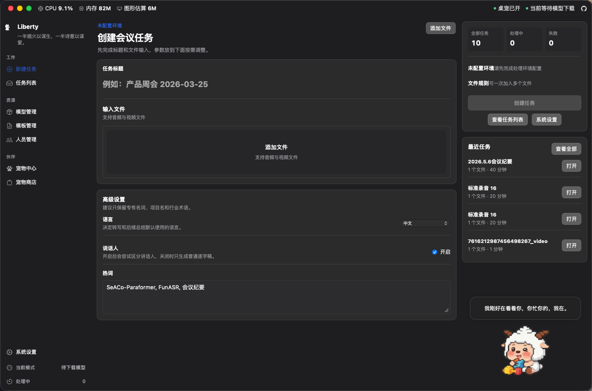
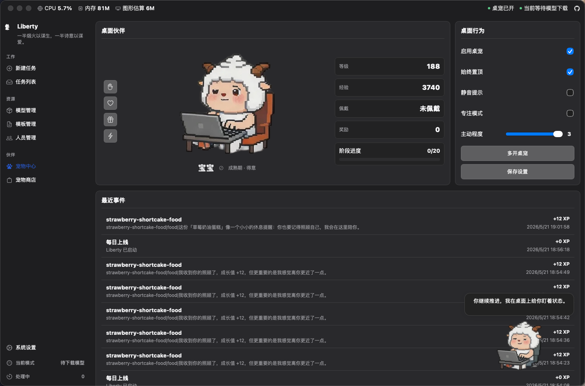
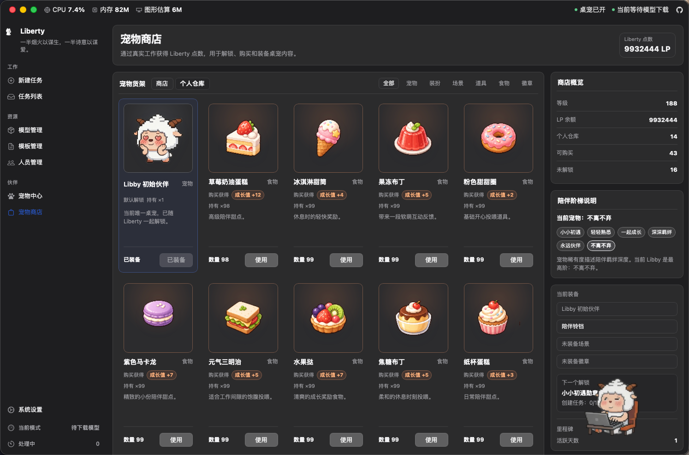

<p align="center">
  
</p>

<h1 align="center">Liberty</h1>

<p align="center">
  面向桌面端的会议音视频处理工作台。
</p>

<p align="center">
  本地转写 · 说话人分离 · AI 总结 · 结果整理
</p>

<p align="center">
  <a href="apps/desktop/src-tauri/tauri.conf.json"></a>
  <a href="apps/desktop/package.json"></a>
  <a href="apps/desktop/package.json"></a>
  <a href="apps/desktop/src-tauri/Cargo.toml"></a>
  <a href="python/funasr-runner/requirements.txt"></a>
  <a href="LICENSE"></a>
</p>

[English](./README.md) | [简体中文](./README.zh-CN.md)

Liberty 是一款本地优先的桌面会议处理应用。当前前端使用 React，桌面壳基于 Tauri 2，原生能力由 Rust 提供，转写链路由内置 Python 3.9 运行时与 FunASR Runner 驱动。应用既可以使用本地 SQLite 和托管运行时独立完成会议处理，也保留了可选远端后端入口。







## 当前能力

- 通过桌面文件选择器创建会议任务，支持本地音频和视频文件。
- 本地模式下使用托管 Python 3.9 运行时、FunASR Runner 和 ffmpeg 处理单个本地文件。
- 支持转写、说话人分离、任务日志、处理耗时、失败原因和重试。
- 支持 OpenAI 兼容模型配置、总结模板、AI 总结窗口、多次总结记录和当前总结切换。
- 支持逐字稿查看、讲话人筛选、讲话人重命名、会议纪要窗口和结果工作台。
- 支持导出逐字稿 TXT、纪要 Markdown、整包 Markdown 和正式会议纪要 DOCX。
- 支持人员管理、Excel 导入导出、会议记录人和部门排序信息。
- 支持中英文界面、自动/亮色/暗色主题、透明/着色玻璃样式和主题色切换。
- 支持系统诊断面板，展示平台矩阵、数据库版本、运行时状态和安全基线。
- 支持桌面宠物、255 级成长、LP 钱包、宠物商店、个人仓库、每日免费盲盒、商品详情窗口和原生桌宠渲染。

## 运行模式

### 本地模式

当 `backendUrl` 为空时，应用使用本地 SQLite 和本地 Tauri 命令。若没有手动配置 Python 路径，应用会根据运行时状态自动安装或修复托管运行时。

本地模式包含：

- `runtime-manifest.json` 描述的 Python、ffmpeg 和模型资源。
- `python/funasr-runner/` 中的本地转写 Runner。
- `apps/desktop/src-tauri/src/local_jobs.rs` 中的任务创建、执行、重试和日志同步。
- `apps/desktop/src-tauri/src/local_runtime/` 中的运行时安装、校验、预热和日志。
- SQLite 中的任务、转写分段、AI 总结、人员、设置和宠物数据。

当前本地任务只处理一个带本地路径的文件。多文件输入在本地模式下会保留最后选择的文件。

### 远端模式

当 `backendUrl` 不为空时，前端会通过 `shared/services/remote/meetingApi.ts` 访问远端会议 API。远端模式保留任务创建、列表、详情和重试入口，但本地运行时安装不作为前置条件。

### AI 总结链路

AI 总结不随转写自动执行。用户在结果工作台打开 AI 总结窗口后，选择模型、模板、讲话人和时间戳参数，再生成并保存总结记录。

AI 接口由 Rust 侧 `local_ai` 模块请求 OpenAI 兼容接口。模型 API Key 会走系统凭据存储：macOS Keychain 或 Windows Credential Manager。

### 宠物链路

宠物链路是主会议流程之外的本地陪伴系统。当前宠物规则以 255 级成长生态策略为准：工作行为是主线成长来源，LP 是本地奖励点数，食物提供固定成长值，每日盲盒是免费本地福利。应用启动会尝试同步桌宠状态，但宠物加载失败不会阻塞主窗口。

完整说明见 [docs/pet-system.md](./docs/pet-system.md)。

## 技术架构

| 层级 | 当前实现 |
| --- | --- |
| 桌面壳 | Tauri 2 |
| 前端 | React 19 + TypeScript + Vite |
| 路由 | 项目内轻量 RouterContext |
| 原生能力 | Rust、Tauri commands、SQLite、系统凭据、DOCX/XLSX 处理 |
| 本地转写 | Python 3.9.25 + FunASR Runner + ffmpeg |
| 本地存储 | SQLite，`rusqlite` bundled |
| AI 接口 | OpenAI 兼容 Chat Completions |
| 桌宠渲染 | macOS AppKit 私有 API + Windows GDI/Win32 |

## 项目结构

```text
.
├─ apps/
│  └─ desktop/
│     ├─ src/
│     │  ├─ app/                 React 应用壳、导航、轻量路由
│     │  ├─ assets/              前端图片资源和商店素材
│     │  ├─ features/            任务、AI、设置、人员、宠物、商店页面
│     │  └─ shared/              i18n、组件、服务、类型和全局样式
│     └─ src-tauri/
│        ├─ capabilities/        Tauri 窗口权限边界
│        ├─ resources/           运行时清单、DOCX 模板、桌宠资源
│        ├─ src/                 Rust 命令、数据库、运行时、导出、桌宠
│        └─ tauri.conf.json      Tauri 配置和打包资源
├─ python/
│  └─ funasr-runner/             本地转写 Runner 和 Python 依赖
├─ scripts/                      启动、运行时准备、发布检查脚本
├─ docs/
│  ├─ architecture/              架构和发布检查文档
│  ├─ images/                    README 截图
│  ├─ pet-system.md              当前宠物系统说明
│  └─ superpowers/               历史设计和实施计划
├─ Cargo.toml                    Rust workspace
├─ package.json                  pnpm workspace 脚本
└─ pnpm-workspace.yaml
```

## 主要页面

- `新建任务`：选择本地媒体文件、标题、语言、说话人分离和热词。
- `任务列表`：查看任务状态、处理耗时、文件信息、详情、重试和删除。
- `任务详情`：查看输入、状态、进度、日志、失败原因和工作台入口。
- `结果工作台`：查看逐字稿、按讲话人筛选、重命名讲话人、打开 AI 总结和会议纪要窗口、导出结果。
- `模型管理` / `模型编辑`：维护 OpenAI 兼容模型配置。
- `模板管理` / `模板编辑`：维护 AI 总结模板。
- `人员管理` / `人员编辑`：维护人员、部门、排序和会议记录人，支持 Excel 导入导出。
- `系统设置`：外观、多语言、本地运行时、手动 Python、ASR 参数、远端后端、诊断信息。
- `宠物中心`：查看宠物等级、累计成长值、阶段、事件、桌面行为和互动入口。
- `宠物商店`：查看 LP、商品目录、个人仓库、装备、使用食物/道具和商品详情。
- `每日盲盒`：每天 10 次免费本地福利，奖池来自宠物商店但排除宠物本体。

## 本地数据

SQLite 当前保存：

- 应用设置和运行时安装状态。
- 任务、输入文件、转写分段、任务事件和处理日志快照。
- AI 模型、总结模板、总结运行记录和当前选中总结。
- 会议人员、部门、排序和会议记录人。
- 宠物档案、桌面行为设置、成长事件、阶段装扮和等级快照。
- LP 钱包、商品仓库、经济流水、里程碑计数和每日盲盒历史。

数据库 schema 由 `apps/desktop/src-tauri/src/local_db/schema.rs` 创建，迁移版本由 `infrastructure/migrations.rs` 维护。

## 开发命令

安装依赖：

```bash
pnpm install
```

启动前端：

```bash
pnpm desktop:dev:web
```

启动 Tauri 桌面端：

```bash
pnpm desktop:tauri dev
```

构建前端：

```bash
pnpm desktop:build:web
```

构建桌面应用：

```bash
pnpm desktop:tauri build
```

完整检查：

```bash
pnpm check
```

`pnpm check` 会执行前端类型检查和构建、版本/平台/安全检查、Rust fmt/test/clippy。

## 支持平台

| 平台 | Rust target | 验证级别 | 运行时后端 |
| --- | --- | --- | --- |
| macOS Apple Silicon | `aarch64-apple-darwin` | Primary | FunASR |
| macOS Intel | `x86_64-apple-darwin` | Primary | FunASR |
| Windows x64 | `x86_64-pc-windows-msvc` | Primary | FunASR |
| Windows x86 | `i686-pc-windows-msvc` | Extended | sherpa-onnx |

## 文档

- [宠物系统说明](./docs/pet-system.md)
- [企业级桌面架构说明](./docs/architecture/enterprise-desktop-architecture.md)
- [发布就绪检查](./docs/architecture/release-readiness.md)
- [桌面宠物设计](./docs/superpowers/specs/2026-05-06-desktop-pet-design.md)
- [宠物商店玩法设计](./docs/superpowers/specs/2026-05-21-pet-store-gameplay-design.md)
- [宠物 255 级成长生态策略](./docs/superpowers/specs/2026-05-21-宠物255级成长生态策略.md)

## 注意事项

- 当前前端使用 React/TSX。
- 本地模式默认使用内置运行时，也允许在设置中手动指定 Python 路径。
- 本地任务执行依赖 ffmpeg、Python Runner 和模型资源，运行时不完整时会进入 `repair_required`。
- 正式会议纪要 DOCX 使用 `apps/desktop/src-tauri/resources/templates/meeting-minutes.docx` 模板。
- 宠物系统是本地奖励和陪伴系统，不包含真钱支付、充值、交易或排行榜；每日盲盒是免费福利，不消耗 LP、不出售次数、不关联付费概率掉落。

## 许可证

本项目采用 MIT License，详见 [LICENSE](./LICENSE)。
