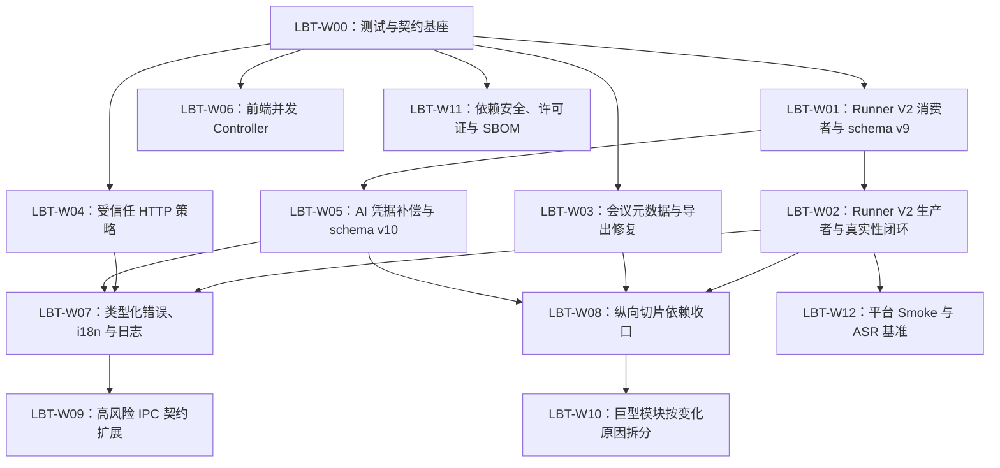

# Liberty 企业级整改可执行实施计划

文档类型：计划  
状态：执行中（代码整改完成，外部验收待完成）  
实施状态：`W00`–`W11` 已完成；`W12` 验证框架已完成，三平台 8 GiB 实机证据阻塞  
创建日期：2026-08-12  
最后核实：2026-08-13  
适用范围：Liberty `main` 分支提交 `16a74716e433ed4b38f9ba9af38bbfdb5dfe4b60` 及其当前未提交整改工作树；对应 `LBT-R01` 至 `LBT-R14`  
权威边界：本文定义整改实施顺序、已锁定决策、工作包、改动落点、验证命令和退出条件；实际行为仍以合并后的代码、测试、数据库迁移和正式架构文档为准  
依据：[Liberty 企业级代码库综合审查与整改方案](../reviews/2026-08-12-enterprise-codebase-review.md)、当前源码与测试、`docs/architecture/enterprise-desktop-architecture.md`、`AGENTS.md`  

## 1. 执行结论

本计划已从“可创建 issue 和拆分 PR”进入实际执行。`W00`–`W11` 的代码、自动化测试与 CI/Release 门禁已落地；`W12` 的 schema、阈值、命令、阻断夹具和证据聚合已落地，但真实 macOS Apple Silicon 8 GiB、macOS Intel 8 GiB、Windows x64 8 GiB 设备及受控媒体尚未取得，因此总体状态不能标记为“已完成”。

执行遵循以下硬规则：

1. 一个工作包只解决一个主要风险，可分多个顺序 PR，但不得把无关重构混入同一 PR。
2. 前置工作包的退出门禁未通过，依赖它的工作包不得开始。
3. 先让消费者兼容新旧协议，再切换生产者；不得让已发布客户端读不到新结果。
4. 数据库只做可恢复的向前迁移；发布后不承诺旧版客户端能重新打开已升级数据库。
5. 不重写历史业务数据，不把无法证明的历史值自动改成“正确值”。
6. 每个纵向切片完成后，旧 command / façade 必须只做兼容转发；不长期保留双写或两套业务规则。
7. 每个 PR 从本工作包的专项测试开始，合并前执行第 6 节的公共质量门禁。

### 1.1 当前工作包状态

| 工作包 | 状态 | 已落地结果 | 未关闭事项 |
| --- | --- | --- | --- |
| `W00` | 已完成 | 前端/Python 测试、Runner 契约基座、契约无漂移和 CI 门禁 | 无 |
| `W01` | 已完成 | Runner V1/V2 双读、领域不变量、schema v9 与历史状态映射 | V1 删除仍受 D04 稳定发布周期约束 |
| `W02` | 已完成 | Runner V2 原子输出、结构化事件、真实 diarization 降级语义及全链路消费 | 原生客户端真实模型手工验收并入 `W12` |
| `W03` | 已完成 | 会议元数据权威顺序、旧固定三元组隔离、payload/导出同源 | 无 |
| `W04` | 已完成 | AI/远端共用受信任 HTTP 目标策略，凭据发送前完成校验 | 在线 provider 真实请求不在本轮自动化范围 |
| `W05` | 已完成 | AI 凭据 stage/publish/cleanup 补偿及重试清理 | 无 |
| `W06` | 已完成 | 轮询、查询、运行时安装、设置保存和远端能力 Controller 可确定性测试 | 无 |
| `W07` | 已完成 | 类型化错误、双语展示、脱敏结构化日志与轮转 | 无 |
| `W08` | 已完成 | ASR、会议纪要、设置/运行时、AI 凭据纵向切片依赖收口 | 旧 façade 仅保留兼容入口 |
| `W09` | 已完成 | meeting job、settings、AI、runtime 高风险 IPC schema 与生成类型 | pet/farm 未修改域仍按原计划延期 |
| `W10` | 已完成 | 热点编排职责按变化原因拆分，公共 API 和事务边界由测试保护 | 后续仅按真实变化热点滚动拆分 |
| `W11` | 已完成（本机实扫阻塞） | 固定版本扫描策略、阻断夹具、Dependabot、894 组件 CycloneDX SBOM 与 Release 集成 | 本机未安装 `cargo-deny 0.20.2`/OSV Scanner `2.5.0`；CI 会安装并执行 blocking gate |
| `W12` | 框架已完成，实证阻塞 | 清单 schema、场景阈值、Runner 基准、平台 smoke、证据聚合与篡改/缺项阻断 | 三类 8 GiB 物理设备、受控媒体、人工标注和正式证据尚未提供 |

### 1.2 下一步可直接执行的验收队列

1. 在受控位置准备六类脱敏媒体与人工标注，复制 `benchmarks/asr/manifest.schema.json` 的约束创建被忽略的 `benchmarks/asr/manifest.local.json`。
2. 分别在 macOS Apple Silicon 8 GiB、macOS Intel 8 GiB、Windows x64 8 GiB 登记设备执行 `pnpm asr:fixtures:check`、`pnpm asr:benchmark` 和 `pnpm platform:smoke`。
3. 将同一 commit、同一 runtime/model set 的证据汇总到受控目录，执行 `pnpm asr:evidence:check -- --evidence-dir <目录>`；任何缺项、哈希变化或阈值失败都保持阻塞。
4. 在具备固定扫描器的环境执行 `pnpm security:check` 与 `pnpm licenses:check`；本机缺工具时退出码 `2` 是“前置工具不可用”，不是扫描通过。
5. 完成上述外部证据后再决定是否关闭 `W12`；本轮没有默认引擎切换，FunASR 继续作为默认引擎。

## 2. 范围与非目标

### 2.1 本轮范围

- 修复说话人结果真实性、导出固定组织信息、AI HTTP 目标和凭据一致性风险。
- 建立前端、Python、Runner 跨进程契约测试和 CI 门禁。
- 用版本化契约、类型化错误和结构化日志收口跨层语义。
- 按 ASR、AI 凭据、会议纪要、设置/运行时四个纵向切片落实 application/domain/port/infrastructure 依赖方向。
- 建立依赖漏洞、许可证、SBOM 和真实 ASR 基准治理。

### 2.2 非目标

- 不在本轮切换 Liberty 默认 ASR 模型；默认仍为 FunASR Paraformer。
- 不引入第二套前端状态管理、路由或样式体系。
- 不一次性搬迁全部 `local_*` 文件，也不以文件行数作为唯一拆分条件。
- 不在普通 PR 中下载真实 ASR 模型或执行桌面安装包、签名、公证和全平台模型基准。
- 不把 VibeVoice 或其他大模型设为普通电脑的默认本地引擎。
- 不在修复导出固定值时新增完整的会议元数据编辑产品流程；现有字段先恢复真实权威顺序。

## 3. 已锁定实施决策

### D01 跨语言契约的唯一事实来源

- 版本化 JSON Schema 是 Runner 文件协议和后续高风险 IPC DTO 的唯一事实来源。
- 首期只覆盖 Runner V2，schema 放在：
  - `packages/shared-types/schemas/runner/v2/result.schema.json`
  - `packages/shared-types/schemas/runner/v2/progress.schema.json`
  - `packages/shared-types/schemas/runner/v2/event.schema.json`
- Rust 使用 `typify` 从 schema 编译生成类型；不得再在 `local_jobs.rs` 手写第二份 Runner V2 DTO。
- TypeScript 使用 `json-schema-to-typescript` 生成只读产物到 `packages/shared-types/src/generated/runner-v2.ts`。
- Python 不生成运行时代码；pytest 直接用同一 schema 校验 fixture 和 Runner 输出。
- `scripts/generate-contracts.mjs` 负责生成，`scripts/check-contracts.mjs` 在临时目录重新生成并比较；生成物不得手工修改。
- 新增、删除或重命名协议字段只改 schema；任何消费者未同步时 `pnpm contracts:check` 必须失败。

### D02 Runner V2 结果语义

`result.json` 必须包含以下字段并拒绝未知字段：

| 字段 | 约束 |
| --- | --- |
| `protocolVersion` | 固定为 `2` |
| `asrBackend` | `funasr` 或 `sherpa-onnx` |
| `diarizationRequested` | 用户本次是否请求说话人分离 |
| `diarizationStatus` | `disabled`、`completed`、`unavailable`、`failed` |
| `warnings` | `{ code, message }[]`；`code` 稳定，`message` 仅作诊断 |
| `durationMinutes` | 非负整数 |
| `transcriptSegments` | 成功结果必须非空 |
| `speakerSegments` | 只有真实说话人结果时才非空 |

必须同时满足：

- 未请求说话人时为 `disabled` 且 `speakerSegments=[]`。
- `completed` 必须已请求说话人，且至少存在一个非空 speaker label。
- `unavailable` / `failed` 必须已请求说话人，且 `speakerSegments=[]`。
- 说话人不可用或失败不抹掉有效逐字稿；任务 ASR 可完成，但必须持久化降级状态和稳定 warning code。
- 不允许以 `Speaker 1` 或任何默认名称填充缺失标签。
- V2 `result.json` 只在整体转写成功时发布，不包含 `failureReason`。整体失败由非零进程退出码、`progress.stage=failed` 和结构化 failure event 表达，避免两个失败事实来源。

`progress.json` 同样使用 V2 schema，增加 `protocolVersion=2` 和单调递增的 `revision`。Python 写入同目录临时文件，`flush + os.fsync + os.replace` 后再发布；消费者忽略小于当前已见 revision 的快照。

Runner stdout 固定为由 `event.schema.json` 约束的 JSON Lines，每行至少包含 `protocolVersion=2`、`type`、`level`、`code` 和脱敏后的 `message`；普通调试文本不得写入 stdout。Rust 逐行解析事件并投影到受限 `process.log`，无法解析的行记为协议错误。stderr 只用于进程级诊断，进入日志前执行相同脱敏和长度限制。

### D03 应用层说话人状态

数据库和 `MeetingJob` 使用独立于任务生命周期的 `diarizationStatus`：

`disabled | pending | processing | completed | unavailable | failed | legacy_unverified`

- `asrStatus` 表示转写任务是否完成；`diarizationStatus` 表示说话人能力实际结果，两者不得合并。
- `includeSpeaker=true` 的 AI 总结只有在 `diarizationStatus=completed` 时允许；其他状态仍允许生成逐字稿级总结。
- UI、AI prompt、成员映射和导出只把 `completed` 的 speaker segments 当作已验证人员分段。
- `legacy_unverified` 数据保留在数据库中用于审计和手动查看，但默认业务投影改用 transcript，不参与按人总结和人员归属。

### D04 Runner V1 与历史数据兼容

- 消费者先上线：Rust 在一个发布周期内同时接受“无 `protocolVersion` 的 V1”和 V2。
- V1 且未请求说话人：映射为 `disabled`。
- V1 且请求说话人：原始 segments 不删除，但状态映射为 `legacy_unverified`，不得推断为真实分离成功。
- V2 生产者及运行时资产全部发布并完成一个稳定发布周期后，再以独立 PR 删除 V1 读取。“一个稳定发布周期”定义为：V2 随正式版本发布满 14 个自然日、三个主要平台 smoke 通过、期间无未关闭的 P0/P1 Runner 协议回归；三项缺一不可。
- 删除 V1 读取前新增只读 `scripts/audit-runner-protocol.mjs`，扫描用户明确选择的诊断目录或脱敏 fixture，只报告 V1/V2/非法结果数量，不上传、不改写任务文件。发现任何待恢复的 V1 任务时保留兼容层；历史数据库中的 `legacy_unverified` 记录不要求删除。
- schema v9 迁移只增加元数据列，不删除历史 segments：
  - `runner_protocol_version INTEGER`
  - `asr_backend TEXT NOT NULL DEFAULT 'unknown'`
  - `diarization_status TEXT NOT NULL`
  - `warnings_json TEXT NOT NULL DEFAULT '[]'`
- 迁移映射：`enable_speaker=0 -> disabled`；已完成且 `enable_speaker=1 -> legacy_unverified`；未完成且请求说话人 -> pending；失败任务 -> failed。

### D05 会议元数据权威顺序

新生成的 `MeetingMinutesPayload` 使用以下固定顺序：

1. `schemaVersion=2` 且 `meetingInfoSource=user` 的已持久化 `MeetingMinutesPayload.meetingInfo`。
2. 当前 AI summary `overview` 中可验证解析出的字段，生成 payload 时标记 `meetingInfoSource=ai`。
3. 空字符串并标记 `meetingInfoSource=empty`；渲染层统一显示“待补充”，不得在 domain/payload 中写占位词。

实施细节：

- 删除 `FIXED_MEETING_TIME`、`FIXED_MEETING_LOCATION`、`FIXED_MEETING_HOST` 及所有覆盖逻辑。
- 新 payload 使用 `schemaVersion=2` 并增加 `meetingInfoSource: user | ai | empty`；现有 `MeetingMinutesInfo` 已覆盖所需字段，不新增数据库列。当前代码尚无保存会议字段的用户入口，因此首期实际生成 `ai` 或 `empty`；未来新增编辑入口必须保存为 `user`。
- 历史 `schemaVersion=1` payload 不批量改写。若时间、地点、主持人三个字段同时精确匹配旧固定三元组，只在 projection/export 时视为缺失并显示警告；原始 JSON 保留以便审计和回滚。
- 单个字段刚好相同不触发清理，避免误伤真实历史数据。

### D06 数据库迁移与回滚

- `LBT-W01` 增加 schema v9；`LBT-W05` 增加凭据清理 intent 表和 schema v10。每个版本只承担一个迁移目的，并同步 `infrastructure/migrations.rs::CURRENT_SCHEMA_VERSION`。
- 每个迁移覆盖：v8 旧库升级、重复启动、未来版本拒绝、迁移失败后备份可用。
- 应用发布前保留现有一致性备份机制。回滚方式是恢复迁移前备份并运行旧版应用，不对已升级数据库执行逆向 SQL。
- 代码回滚不得删除用户媒体、任务目录、系统凭据或迁移备份。

### D07 工作包与提交边界

- 每个工作包建议 1–3 个顺序 PR；一个 PR 必须可编译、可测试，且不得依赖未合并分支。
- 数据库迁移、消费者兼容和生产者切换不得塞进同一个不可回退的大提交。
- 下文工期为一名熟悉仓库的工程师的 P50 工程估算，不含产品验收、代码评审等待、真实模型下载和跨平台硬件排队；用于排容量，不是交付承诺。

## 4. 工作包依赖图



并行规则：`W03`、`W04`、`W06`、`W11` 在 `W00` 完成后可并行；`W01` 完成 schema v9 后，`W02` 与 `W05` 可并行；`W08` 不得早于三个业务正确性切片完成。

## 5. 工作包定义

### LBT-W00 测试与契约基座

**对应问题：** `LBT-R05`、`LBT-R06`、`LBT-R12` 的测试前置部分  
**主责角色：** 工程效率 / 全栈  
**依赖：** 无  
**估算：** 2–4 人日，建议 2 个 PR

**PR 1：前端与 Python 测试入口**

- 在 `apps/desktop/package.json` 添加 Vitest 和 `test` / `test:watch`，测试环境默认 `node`；只有真实 DOM 测试才单独启用 `jsdom`。
- 新增 `python/funasr-runner/requirements-dev.txt`，使用 `==` 精确固定 pytest、Ruff、jsonschema；同步生成带 `--hash` 的 `requirements-dev-lock.txt`，不得混入发布运行时 lock。
- 新增 `scripts/bootstrap-python-dev.mjs`：发现 Python 3.10+，创建 `.venv-dev`，按哈希 lock 安装依赖；同时把 `.venv-dev/` 加入 `.gitignore`。本地 `python:*` 脚本只使用该解释器，不依赖全局 pytest/Ruff。
- 在根 `package.json` 添加：
  - `python:bootstrap`
  - `desktop:test`
  - `python:lint`
  - `python:test`
- 为现有纯函数建立首批 characterization tests：
  - `features/meeting/application/jobSnapshots.ts`
  - `features/meeting/application/polling.ts`
  - `features/meeting/application/settingsPolicy.ts`
  - `python/funasr-runner/runner.py::extract_segments`

**PR 2：契约骨架和 CI**

- 初始化 `packages/shared-types/package.json`、Runner V2 schema、生成脚本和生成物说明。
- 增加 `contracts:generate`、`contracts:check`、`check:fast` 根脚本。
- `.github/workflows/quality.yml` 使用固定 SHA 的 Python setup action，通过 `pnpm python:bootstrap` 安装 dev lock，并执行前端测试、Ruff、pytest、契约无漂移检查。
- 所有 Python 契约测试不得导入 FunASR、Torch 或下载模型；通过 fixture/fake backend 覆盖。

**专项验证**

```bash
pnpm python:bootstrap
pnpm desktop:test
pnpm python:lint
pnpm python:test
pnpm contracts:check
```

**退出门禁**

- `python:bootstrap` 是唯一允许联网安装 Python 开发依赖的准备步骤；完成一次 bootstrap 后，其余四条专项命令在无模型、无网络条件下可重复执行。
- 修改 schema 但不更新生成物时 `contracts:check` 失败。
- 测试失败不会被标记为 skipped 或 allowed failure。

**回滚点**

- 仅新增开发依赖、脚本和 CI 步骤；可整体回滚，不影响运行时和用户数据。

### LBT-W01 Runner V2 消费者与 schema v9

**对应问题：** `LBT-R01`、`LBT-R05`、`LBT-R07`  
**主责角色：** Rust / SQLite  
**依赖：** `LBT-W00`  
**估算：** 4–6 人日，建议 2–3 个 PR

**改动落点**

- 新增 `apps/desktop/src-tauri/src/domain/asr.rs`：`DiarizationStatus`、warning code、结果不变量。
- 新增 `apps/desktop/src-tauri/src/application/complete_asr_job.rs`：验证 Runner 结果并完成任务的 use case。
- 新增 `apps/desktop/src-tauri/src/infrastructure/runner_protocol.rs`：V1/V2 读取、schema 生成类型接入和兼容映射。
- 修改 `local_jobs.rs`：保留 command/scheduler façade，只调用 use case，不再拥有 Runner DTO 与完成策略。
- 修改 `local_db/model.rs`、`local_db/schema.rs`、`infrastructure/migrations.rs` 和 job repository，加入 D04 的 v9 字段与迁移。
- 同步 `apps/desktop/src/shared/types/meeting.ts` 和本地/远端 adapter 的新增只读字段；远端只有显式返回版本化 diarization status 时才能映射为 `completed`，旧远端 payload 映射为 `legacy_unverified`，不得仅因 speaker segments 非空而推断成功。

**实施顺序**

1. 合入 schema 与 Rust V2 类型，但保持当前 V1 生产者不变。
2. 合入 v9 迁移和 `MeetingJob` 状态字段；`ADD COLUMN diarization_status` 使用临时安全默认值后在同一 transaction 按 D04 回填，不能对有数据表直接增加无默认值的 `NOT NULL` 列。
3. 合入双读消费者：V1 进入兼容映射，V2 执行严格不变量验证。
4. 将 `complete_local_job_run` 参数收拢为类型化 completion input，并让旧 façade 转发。

**专项测试**

- V1：speaker 关闭、speaker 开启且带默认标签、字段缺失、非法 JSON。
- V2：四种 diarization result、未知字段、版本不支持、矛盾状态、空逐字稿、空 speaker label。
- v9：v8 真实临时库升级、重复启动、备份、完成/失败/运行中任务映射。
- fence：旧 attempt/lease 不得覆盖当前任务状态。

**专项验证**

```bash
cargo test --locked runner_protocol
cargo test --locked complete_asr_job
cargo test --locked schema
pnpm desktop:typecheck
pnpm contracts:check
```

**退出门禁**

- 当前 V1 Runner 不改动仍可完成转写。
- V1 speaker 数据只标为 `legacy_unverified`；V2 矛盾数据被拒绝并留下稳定错误码。
- v8 用户库可升级且原始 transcript/speaker segments 数量不变。

**回滚点**

- 生产者尚未切 V2，代码回滚只需恢复 v9 备份后运行旧版；不得直接降低 schema version。

### LBT-W02 Runner V2 生产者与真实性闭环

**对应问题：** `LBT-R01`、`LBT-R12`、`LBT-R13`  
**主责角色：** Python / Rust / 前端  
**依赖：** `LBT-W01`  
**估算：** 4–6 人日，建议 2 个 PR

**改动落点**

- `python/funasr-runner/runner.py`：输出 V2、删除所有默认 `Speaker 1`、原子写 JSON、progress revision。
- `apps/desktop/src-tauri/src/infrastructure/runner_process.rs`：解析 stdout JSON Lines、限制 stderr，并将协议事件投影为诊断日志。
- `python/funasr-runner/tests/`：四类后端 fixture、并发读取、写入中断、stdout 纯净度。
- `apps/desktop/src/shared/services/meeting/transcript.ts`：只有 `completed` 才优先 speaker segments。
- `apps/desktop/src/features/jobs/views/JobDetailView.tsx`、`JobsView.tsx`：展示明确降级状态和 warning。
- `apps/desktop/src/features/ai-summary/views/AiSummaryView.tsx`：状态非 `completed` 时默认关闭并禁用 include-speaker，允许 transcript-only 总结。
- `apps/desktop/src-tauri/src/local_ai/summary_runs.rs` 和 export source：后端再次校验，不能只信任 UI。
- `shared/i18n/messages/zh-CN.ts`、`en-US.ts`、`types.ts`：补齐双语状态和可操作提示。

**行为矩阵**

| 请求 | 后端结果 | ASR 任务 | 按人总结 | 默认投影 |
| --- | --- | --- | --- | --- |
| 否 | `disabled` | 完成 | 不可选 | transcript |
| 是 | `completed` | 完成 | 可选 | speaker segments |
| 是 | `unavailable` | 完成并警告 | 禁用 | transcript |
| 是 | `failed` | 完成并警告 | 禁用 | transcript |
| 历史 V1 | `legacy_unverified` | 保留原状态并警告 | 禁用 | transcript |

**专项验证**

```bash
pnpm python:lint
pnpm python:test
cargo test --locked runner_protocol
cargo test --locked complete_asr_job
pnpm desktop:test
pnpm desktop:typecheck
```

**手工验收**

- 在开发版原生客户端分别验证 FunASR 有/无真实 speaker label 与 Sherpa-ONNX 降级；不得以 Vite 页面作为验收。
- 数据库、UI、AI prompt、导出和诊断中均不存在新伪造的 `Speaker 1`。
- 降级任务仍能查看逐字稿并生成不含人员归属的总结。

**退出门禁**

- Python 和 Rust 使用同一组 V2 result/progress/event fixture 全部通过，stdout 每个非空行都能按 event schema 解析。
- Runner 写入时消费者只能读到旧完整 JSON 或新完整 JSON。
- 达到 D04 定义的稳定发布周期且审计无待恢复 V1 任务前不得删除 V1 consumer；删除兼容层是独立 PR，不混入 V2 生产者切换。

**回滚点**

- V2 consumer 已先上线，回滚生产者可恢复 V1 输出；不得回滚到不认识 v9 数据库的旧版而不恢复备份。

### LBT-W03 会议元数据与导出真实性

**对应问题：** `LBT-R03`、`LBT-R07`  
**主责角色：** Rust / 产品验收  
**依赖：** `LBT-W00`  
**估算：** 2–4 人日，建议 1–2 个 PR

**改动落点**

- 新增 `domain/meeting_minutes.rs`：字段来源与 legacy 固定三元组识别策略。
- 新增 `application/project_meeting_minutes.rs`：实现 D05 权威顺序。
- `local_export.rs` 只保留 command 和兼容转发；projection 逻辑进入 application/domain，renderer 保持布局职责。
- `local_export/source.rs` 负责读取持久化 payload，但不再静默覆盖会议字段。
- payload `schemaVersion` 升至 2，并增加 `meetingInfoSource`；`MeetingMinutesInfo` 字段保持兼容，不做数据库 schema migration。

**专项测试**

- AI 能解析完整字段、部分字段、全空字段。
- schema v2 且 `meetingInfoSource=user` 的持久化 payload 优先于 AI 文本；`ai` 和 `empty` 按 D05 重新投影。
- schema v1 同时命中固定三元组时投影视为空并记录 warning；单字段命中不清理。
- payload、预览、DOCX/XLSX 使用同一 projection；renderer 对空值显示“待补充”。

**专项验证**

```bash
cargo test --locked local_export
cargo test --locked project_meeting_minutes
pnpm desktop:typecheck
```

**退出门禁**

- 源码和测试中不再存在旧固定人名、地点和时间常量；只允许 legacy 检测 fixture 中保留该三元组。
- 新生成 payload 不含组织专属默认值，历史原始 JSON 未被批量修改。

**回滚点**

- 无数据库 schema 变化；回滚 projection 代码不会丢数据。历史 payload 的原始值始终保留。

### LBT-W04 受信任 HTTP 目标策略

**对应问题：** `LBT-R02`  
**主责角色：** Rust / 安全  
**依赖：** `LBT-W00`  
**估算：** 3–5 人日，建议 2 个 PR

**改动落点**

- 新增 `infrastructure/network/mod.rs` 与 `trusted_http.rs`。
- 将 `local_remote.rs` 的 URL、DNS、IP 和 client 构造逻辑迁移为共享实现，不改变现有远端会议策略。
- AI provider 策略固定为：公网域名/IP 仅 HTTPS；HTTP 仅允许 loopback 字面量 `127.0.0.0/8` 或 `[::1]`；禁止 userinfo、query、fragment、重定向和系统代理。
- 域名请求在 DNS 解析后拒绝私网、链路本地、metadata、组播、未指定地址和公私混合答案，并把验证结果固定到实际连接。
- 前端只做即时格式提示；Rust 是最终授权边界。

**专项测试矩阵**

- 公网 HTTPS、loopback HTTP、localhost 域名、RFC1918、IPv6 ULA/link-local、IPv4-mapped IPv6。
- userinfo、query、fragment、非 HTTP(S)、重定向、DNS rebinding、公私混合答案。
- 校验失败时 mock server 证明零请求，错误中不含 API Key、prompt、URL query 或响应 body。

**专项验证**

```bash
cargo test --locked trusted_http
cargo test --locked local_remote
cargo test --locked local_ai
pnpm desktop:typecheck
```

**退出门禁**

- remote meeting 现有测试保持通过。
- AI provider 在凭据加入请求前完成目标授权；失败路径无网络连接。

**回滚点**

- 先迁移远端会议且保持行为等价，再接 AI；若 AI 兼容性异常，仅回滚 AI 接入，不复制回旧网络实现。

### LBT-W05 AI 凭据写入与删除补偿

**对应问题：** `LBT-R04`、`LBT-R07`  
**主责角色：** Rust / SQLite  
**依赖：** `LBT-W01`（schema v9 必须先合并）  
**估算：** 4–6 人日，建议 2–3 个 PR

**改动落点**

- 在 `infrastructure/credentials.rs` 提取可复用 `CredentialWritePlan`，复用 settings 已验证的 stage/publish/confirm/finalize/rollback 模式。
- 新增 `application/save_ai_model.rs` 和 `delete_ai_model.rs`，command 只校验输入并调用用例。
- `ai_models.rs` repository 只执行 SQL，不直接调用 Keychain/Credential Manager。
- 增加 schema v10 `credential_cleanup_intents`，记录 model id、credential reference、operation、attempt、last error、created/updated time。
- 启动恢复幂等清理已失去数据库引用的 staged/retired credential；清理失败保留 intent，不能让模型记录回滚为已删除前状态。

**失败注入矩阵**

- staged credential 写失败、SQL 执行失败、commit 失败、commit 结果不确定。
- 旧 credential 清理失败、删除 intent 写失败、重复删除、进程在 publish/finalize 间退出、重启恢复。
- 任一节点后均能回答“数据库当前引用哪个 credential”和“待清理项是什么”。

**专项验证**

```bash
cargo test --locked ai_models
cargo test --locked save_ai_model
cargo test --locked delete_ai_model
cargo test --locked schema
```

**退出门禁**

- repository 测试不依赖真实系统凭据存储。
- 返回失败时不会出现模型仍存在但有效 credential 已被覆盖/删除的状态。
- 删除失败可重试，且不会留下无法定位的 credential。

**回滚点**

- schema v10 intent 记录不得随代码回滚删除；恢复旧版前使用迁移备份。不得用“清空 Keychain”作为回滚。

### LBT-W06 前端并发 Controller 拆分

**对应问题：** `LBT-R06`、`LBT-R08`  
**主责角色：** 前端  
**依赖：** `LBT-W00`  
**估算：** 5–8 人日，建议 3 个 PR

**改动落点与顺序**

1. 先为 `useMeetingStore` 建 characterization tests，不改变行为。
2. 提取 `JobQueryController`：请求 generation、stale response、删除/重试 fence。
3. 提取 `RemoteCapabilitySession`：握手 promise、重试 timer、模式切换释放。
4. 提取 `SettingsSaveCoordinator`：revision、串行写队列、冲突刷新。
5. 提取 `RuntimeInstallController`：安装轮询、取消/完成清理。
6. Store 只组合 snapshot/actions；controller 通过 meeting service、clock、scheduler 显式注入。

**专项测试**

- fake clock + fake service 覆盖 stale response、模式切换、删除后迟到响应、重试 fence、revision 冲突、卸载 listener 后零 timer。
- 每个 controller 不导入 React 或 Tauri API。
- 重构前后对同一事件序列产生相同 store snapshot。

**专项验证**

```bash
pnpm desktop:test
pnpm desktop:typecheck
pnpm desktop:build:web
```

**退出门禁**

- `useMeetingStore` 不再直接持有远端 retry timer、settings save queue 和 runtime polling scheduler。
- 不引入新状态框架；现有 View API 和用户流程保持兼容。

**回滚点**

- 每个 controller 独立 PR；后一个提取失败可回滚而不撤销已稳定的前一个 controller。

### LBT-W07 类型化错误、国际化与结构化日志

**对应问题：** `LBT-R10`、`LBT-R11`、`LBT-R13`  
**主责角色：** Rust / 前端 / 安全  
**依赖：** `LBT-W02`、`LBT-W04`、`LBT-W05`  
**估算：** 6–9 人日，建议 3 个 PR

**技术决策**

- 扩展 `domain/error.rs` 为 `AppError { code, category, retryable, context, source }`；`source` 只进诊断，不序列化给 UI。
- Tauri mapper 输出稳定 `{ code, category, retryable, params }`，前端 i18n 根据 code 映射；过渡期保留 legacy string mapper，但新增/修改用例不得返回自由字符串协议。
- 新增 `infrastructure/observability/`，区分 job event、diagnostic event、audit event；状态事实仍在 `job_events`。
- 默认脱敏 token、userinfo/query、用户路径、逐字稿、provider body 和宠物自定义文本；日志按大小轮转并设置总量上限。

**迁移顺序**

1. 先定义 error DTO、日志 facade 和前端 fallback，不迁移业务调用方。
2. 迁移 Runner、trusted HTTP、AI credential 三个已完成切片。
3. 再迁移 meeting export、settings/runtime；其余 legacy string 按后续切片消化。

**专项验证**

```bash
cargo test --locked domain::error
cargo test --locked observability
pnpm desktop:test
pnpm desktop:typecheck
node scripts/check-security-baseline.mjs
```

**退出门禁**

- 三个高风险切片的用户错误可双语显示，不依赖中文字符串前缀。
- 诊断导出 fixture 中不存在 secret、完整用户路径、逐字稿或 provider body。
- 日志轮转测试证明总量上限和重启行为。

**回滚点**

- legacy string mapper 保留一个发布周期；回滚单个调用方不影响新的 error DTO 解析。

### LBT-W08 纵向切片依赖收口

**对应问题：** `LBT-R07`  
**主责角色：** Rust 架构  
**依赖：** `LBT-W02`、`LBT-W03`、`LBT-W05`  
**估算：** 6–10 人日，建议每个切片 1 个 PR

**切片清单**

| 切片 | Command / Façade | Application | Domain Port / Policy | Infrastructure |
| --- | --- | --- | --- | --- |
| ASR 完成 | `local_jobs.rs` | `complete_asr_job.rs` | `asr.rs` | runner protocol/process/files、job repository |
| AI 凭据 | `local_ai.rs` | save/delete AI model | credential plan | ai model repository、credential store |
| 会议纪要 | `local_export.rs` | project meeting minutes | metadata authority | payload repository、renderer/files |
| 设置/运行时 | `local_settings.rs` / `local_runtime.rs` | save settings、switch/install runtime | source/install policy | settings/runtime repositories、platform/files/http |

前三个切片由前置工作包建立，本工作包负责验收依赖方向并完成设置/运行时切片。使用 `rg` 检查：

- `domain/` 不引用 `tauri`、`rusqlite`、`reqwest`、`local_db`、`PathBuf`。
- `application/` 不接受 `AppHandle`、`WebviewWindow`，通过 port/context 调用能力。
- `infrastructure/` 不依赖 command 模块，不返回 `local_db::LocalResult<String>`。
- 旧 command 不包含 SQL、子进程生命周期或文件发布策略。

**专项验证**

```bash
cargo test --workspace --locked
pnpm rust:fmt:check
cargo clippy --workspace --all-targets --locked -- -D warnings
rg -n 'tauri|rusqlite|reqwest|local_db|PathBuf' apps/desktop/src-tauri/src/domain
rg -n 'AppHandle|WebviewWindow' apps/desktop/src-tauri/src/application
```

后两条 `rg` 应无匹配；若存在平台值对象等获批例外，必须在正式架构文档列出原因和替代边界。

**退出门禁**

- 四个切片可在无 WebView 的测试中调用 use case。
- 每个旧 façade 只有校验、授权、DTO 映射和用例调用；对应旧业务实现已删除。

**回滚点**

- 一次只收口一个切片；不得建立新旧 repository 双写。回滚通过恢复该切片 façade 的旧调用路径完成。

### LBT-W09 高风险 IPC 契约扩展

**对应问题：** `LBT-R05`  
**主责角色：** Rust / TypeScript  
**依赖：** `LBT-W07`、`LBT-W08`  
**估算：** 5–8 人日，建议按域拆 4 个 PR

**迁移顺序**

1. `meeting-job-v1`：job snapshot、segments、diarization/error DTO。
2. `settings-v1`：public settings、revision、runtime source。
3. `ai-v1`：model metadata/save input、summary run/result。
4. `runtime-v1`：component state、install status、diagnostics。

每个域都执行：schema 建立 → Rust/TS 生成 → adapter 切换 → fixture 双向解析 → 删除 `meeting.ts` 对应手写类型。pet/farm 类型在本轮只拆文件，不强制进入生成契约，除非它们跨 Tauri 边界且本轮被修改。

**专项验证**

```bash
pnpm contracts:generate
pnpm contracts:check
pnpm desktop:typecheck
cargo test --workspace --locked
```

**退出门禁**

- 上述四个域的协议字段只在 schema 定义一次。
- 至少保留当前版和前一版 fixture；破坏性变更必须使用新 schema 版本，不原地改旧版本。
- `meeting.ts` 按 meeting、ai、runtime、settings、pet、farm、diagnostics 分拆后不再承担无关聚合职责。

**回滚点**

- 每个域单独合并；旧 schema 和前一版 fixture 不删除，adapter 可按版本回退。

### LBT-W10 巨型模块按变化原因拆分

**对应问题：** `LBT-R09`  
**主责角色：** 模块维护者  
**依赖：** `LBT-W08`  
**估算：** 8–15 人日，按热点滚动执行

**启动条件**

单个模块只有同时满足以下任意两项才拆：近 30 天存在高频冲突、包含三个以上独立变化原因、无法隔离测试、单次变更必须理解不相关事务。未达到条件的模块只登记，不为了降行数拆分。

**首选拆分顺序**

1. `local_runtime.rs`：component state、acquire、publish、validation；command 仅 façade。
2. `local_export.rs`：projection、speaker resolution、template mapping、render command。
3. `local_db.rs` / `local_db/schema.rs`：connection factory、repository façade、每版本 migration。
4. `ai_summary_runs.rs`：execution、chunk lease、projection、retention。
5. `pet_store.rs`：只有确认实际冲突/变化频率后，按 catalog、wallet、inventory、purchase、gift box、milestone 拆。

**每次拆分步骤**

1. 记录变更原因和事务边界。
2. 补 characterization tests。
3. 机械移动一个职责并保持公开接口。
4. 运行相邻测试和 workspace 门禁。
5. 删除旧转发或明确其兼容期限。

**专项验证**

```bash
cargo test --workspace --locked
pnpm rust:fmt:check
cargo clippy --workspace --all-targets --locked -- -D warnings
pnpm desktop:typecheck
```

每个拆分 PR 还必须在 PR 描述中列出被移动职责的相邻测试名称、公开 API 对照和事务边界；上述全量命令不能替代对应模块的 characterization tests。

**退出门禁**

- 拆分后没有跨模块半事务；事务仍由一个 application use case 控制。
- 模块依赖方向符合 `LBT-W08`，测试定位更窄，公开 API 未无意义增加。

**回滚点**

- 一个 PR 只拆一个变化原因；禁止跨多个巨型文件同步搬家。

### LBT-W11 依赖安全、许可证与 SBOM

**对应问题：** `LBT-R14`  
**主责角色：** 工程效率 / 安全 / 发布  
**依赖：** `LBT-W00`  
**估算：** 3–5 人日，建议 2 个 PR

**实施内容**

- Rust：`cargo-deny` 统一漏洞、来源和许可证策略；配置明确 allow/deny，不接受默认空策略。
- Node/Python：选择支持 lockfile 的 OSV 扫描；扫描服务不可用时 job 明确失败或标为 externally unavailable，不得输出假通过。
- 生成 CycloneDX 或 SPDX SBOM，覆盖 Rust、Node、Python runtime lock；Release 附带 SBOM 和生成工具版本。
- 添加 Dependabot/Renovate 只创建 PR，不自动合并、不自动发布；运行时大依赖升级必须触发 `LBT-W12` 基准。

**专项验证**

```bash
pnpm security:check
pnpm licenses:check
pnpm sbom:generate
pnpm release:check
```

以上前三条由本工作包新增。fixture 必须证明 deny license、已知漏洞和未锁定来源能阻断门禁。

**退出门禁**

- PR 或定时任务能发现 Rust、Node、Python 已知漏洞和许可证违规。
- Release 产物具备可追溯 SBOM，且不包含本地绝对路径或凭据。

**回滚点**

- 安全门禁分 advisory 观察期和 blocking 期两个 PR；观察期记录基线债务，blocking 期不得通过大范围 ignore 清零。

### LBT-W12 平台 Smoke 与真实 ASR 基准

**对应问题：** ASR 技术路线、低配置产品适配和平台未验证项  
**主责角色：** QA / 桌面 / 算法  
**依赖：** `LBT-W02`  
**估算：** 4–8 人日，不计硬件准备与模型下载

**实施顺序与文件落点**

1. 新增 `benchmarks/asr/manifest.schema.json`、`thresholds.json`、`platforms.json` 和 `README.md`，固定样本元数据、指标口径、最低硬件档位与脱敏/获取规则。敏感原始媒体不提交；本地 `manifest.local.json` 和输出目录 `artifacts/asr-validation/` 加入 `.gitignore`。
2. 新增 `scripts/check-asr-fixtures.mjs`，校验本地 manifest、输入 SHA-256、人工标注版本和必需场景；缺失或哈希不一致必须失败，不自动下载或替换样本。
3. 新增 `scripts/run-asr-benchmark.mjs`，在同一设备、同一媒体、同一 runtime/model set 下运行基线与候选，输出带 commit、平台、硬件、版本和原始测量值的 JSON。
4. 新增 `scripts/run-platform-smoke.mjs`，逐平台执行原生客户端 smoke 清单并生成签名为“操作者 + 时间 + commit”的结果；未执行项只能记为 blocked/failed，不能记为 passed。
5. 新增 `scripts/check-asr-evidence.mjs` 聚合三个主要平台 smoke 和基准结果，按下述阈值阻断候选切换；根 `package.json` 增加 `asr:fixtures:check`、`asr:benchmark`、`platform:smoke`、`asr:evidence:check`。

**基准资产**

- 建立本地受控、脱敏且不提交原始敏感会议内容的基准清单：短会、长会、多人交叠、噪声、中英夹杂、中文数字。
- 记录输入哈希、时长、语言、预期 speaker 数和人工标注版本；原始媒体若不能进入仓库，仅提交 manifest 与获取说明。
- 平台至少覆盖 macOS Apple Silicon、macOS Intel、Windows x64；Windows x86 明确为“仅编译”或“不支持本地 ASR”，不得用 cargo check 代替产品支持。

**指标与预算**

- CER/WER、DER、失败率。
- 安装体积、峰值 RSS、冷启动、每分钟音频处理耗时、持续 CPU。
- 每次模型/运行时变更与上一生产版本同机对比；没有基线不得切换默认引擎。

候选默认引擎切换门禁固定为：必需样本零新增失败；中文 CER 中位数不高于基线 0.5 个百分点；请求说话人场景的 DER 不高于基线 1 个百分点且不得产生伪标签；最低硬件档位的 P95 实时率不超过 1.0、峰值 RSS 不超过 4 GiB，且两项均不得比基线恶化超过 10%；托管运行时安装体积增量不超过 500 MiB。任一项不满足则保持 FunASR 默认，不用加权总分掩盖单项失败。

**Smoke 验收**

- 原生客户端安装/启动、单实例、运行时安装、音视频转写、降级提示、AI transcript-only 总结、导出、旧库升级和系统凭据。
- 结果记录平台、commit、runtime/model set version、测试时间和未覆盖项。
- `platforms.json` 至少包含 macOS Apple Silicon 8 GiB、macOS Intel 8 GiB、Windows x64 8 GiB 三类最低档设备；若只能取得更高配置设备，该平台可完成兼容 smoke，但不能关闭低配置性能门禁。Windows x86 只做编译支持声明，不计入三平台本地 ASR smoke。

**专项验证**

以下命令由本工作包新增，并在每台登记设备上从仓库根目录执行；`asr:benchmark` 默认读取已校验的 `benchmarks/asr/manifest.local.json`，结果写入被忽略的本地证据目录：

```bash
pnpm asr:fixtures:check
pnpm asr:benchmark
pnpm platform:smoke
pnpm asr:evidence:check
pnpm release:check
```

前三个平台的结果由 `asr:evidence:check` 汇总；本地样本、目标硬件或人工标注未就绪时命令必须失败并报告缺项，该工作包保持阻塞。

**退出门禁**

- 至少三个主要平台有可审计 smoke 记录；无法获取的硬件明确阻塞，不标记通过。
- 默认 ASR 仍为 FunASR，除非候选在准确率、内存、包体、耗时和稳定性综合达到书面批准阈值。

**回滚点**

- 基准不直接修改默认模型；任何引擎切换另起设计与发布计划。

## 6. 公共质量门禁

### 6.1 每个 PR

工作包新增脚本后，统一执行：

```bash
pnpm check:fast
```

`check:fast` 必须包含：契约无漂移、TypeScript typecheck、前端单元测试、Python Ruff/pytest、Rust fmt 和 workspace Rust 测试。为保证脚本在干净环境可预测运行，先检查 `.venv-dev`；不存在时输出明确的 `pnpm python:bootstrap` 引导并失败，不在质量检查中隐式联网安装。首个工作包建立脚本前，分别运行已存在的最小命令。

### 6.2 跨层或合并里程碑

```bash
pnpm check
cargo test --workspace --locked
cargo clippy --workspace --all-targets --locked -- -D warnings
node scripts/check-release-policy.mjs
node scripts/test-release-checks.mjs
```

`pnpm check` 在 `LBT-W00` 完成后必须纳入新增前端/Python/契约门禁。只有文档变更时不运行桌面构建，但必须执行 `git diff --check` 和文档链接/围栏检查。

### 6.3 Release 候选

- 执行 `LBT-W12` 平台 smoke 和 ASR 基准。
- 执行漏洞、许可证、SBOM 和现有 release checks。
- 分别记录 build、签名、公证、Release、资产校验状态；不得用“CI 绿”概括全部发布结论。

### 6.4 2026-08-13 实际执行记录

执行环境为当前 macOS Apple Silicon 开发机；Node 使用 arm64 运行时和仓库固定的 `pnpm 10.30.3`。外置磁盘不支持 Cargo 增量缓存硬链接，常规 Rust 命令会回退为复制并产生环境 warning；另用 `/tmp` 下隔离 `CARGO_TARGET_DIR` 复核后无代码 warning 或测试失败。

| 命令 | 结果 | 证据边界 |
| --- | --- | --- |
| `pnpm check:fast` | 通过 | 5 个契约生成物无漂移；TypeScript 通过；前端 9 文件/24 测试通过；Ruff 通过；Python 11 测试通过；Rust fmt 与 179 测试通过 |
| `CARGO_TARGET_DIR=<临时目录> cargo test --workspace --locked` | 通过，179 passed | 排除外置磁盘增量缓存与陈旧 artifact 影响后的 Rust 全量结果 |
| `pnpm desktop:build:web` | 通过 | 486 个模块生产构建成功；存在既有大 chunk 警告，不是构建失败 |
| `pnpm rust:clippy` | 通过 | workspace/all-targets 在 `-D warnings` 下通过；仅 Cargo 外置磁盘硬链接回退提示 |
| `pnpm release:check` | 通过 | 版本、平台、安全基线、3 平台 runtime lock、W11/W12 阻断夹具通过 |
| `node scripts/test-release-checks.mjs` | 通过 | Release 检查自测通过；256 MiB 流式哈希峰值 RSS 126.2 MiB |
| `node scripts/generate-sbom.mjs --output <临时文件>` | 通过 | CycloneDX 1.5，Liberty 1.1.24，共 894 组件：Cargo 577、npm 248、PyPI 69 |
| `pnpm security:check` / `pnpm licenses:check` | 阻塞，退出码 2 | 本机未安装固定版本 `cargo-deny`；CI 安装校验后的 `cargo-deny 0.20.2` 和 OSV Scanner `2.5.0` 后执行 |
| `pnpm asr:fixtures:check` | 阻塞，退出码 1 | 缺少被忽略的 `benchmarks/asr/manifest.local.json`，未提供受控媒体/标注 |
| `pnpm asr:evidence:check` | 阻塞，退出码 1 | 缺少 `artifacts/asr-validation/accepted` 三平台正式证据 |

本轮未执行完整 Tauri 打包、安装器、签名、公证、在线 AI 请求、真实 ASR 模型基准或三平台实机 smoke。它们不属于上述“通过”结论。

## 7. 里程碑与容量

时间窗口从实际启动日计算，而不是从本文创建日自动开始。若只有一名工程师，优先保证退出门禁，不以赶 30/60/90 天为理由并包或跳过测试。

### M1：真实性与安全闭环（建议启动后 0–30 天）

**工作包：** `W00 -> W01`；随后 `W02/W05` 可并行；`W00` 后同时可并行完成 `W03/W04`  
**估算容量：** 19–31 人日  
**发布门禁：**

- 新结果不伪造 speaker，旧结果标为 `legacy_unverified`。
- 新导出不含组织专属固定值。
- AI 请求只访问获准目标，凭据失败可恢复。
- 前端/Python/契约测试已进入 CI。

若容量不足，最低可发布集合是 `W00 + W01 + W02 + W03`；`W04/W05` 未完成时必须保留为下一版本 P1 阻断项，不能声称全部 P1 已关闭。

### M2：跨层语义与高频边界（建议 31–60 天）

**工作包：** `W06`、`W07`、`W08`  
**估算容量：** 17–27 人日  
**里程碑门禁：**

- store 并发时序可确定性测试且无悬挂 timer。
- 高风险错误以 code/params 传输并可双语显示。
- 四个纵向切片遵守 command → application → domain/port ← infrastructure。

### M3：持续治理（建议 61–90 天）

**工作包：** `W09`、`W10`、`W11`、`W12`  
**估算容量：** 20–36 人日，不含硬件排队  
**里程碑门禁：**

- 高风险 IPC 由版本化 schema 管理。
- 巨型模块只按实际变化原因拆分，不存在新双写。
- 依赖、许可证和 SBOM 可审计。
- 平台 smoke 与 ASR 基准足以支持后续引擎决策。

## 8. Issue 与 PR 模板

每个工作包创建 issue 时必须包含：

```markdown
工作包：LBT-Wxx
对应风险：LBT-Rxx
基线提交：<sha>
依赖工作包：<已完成链接>
范围内文件：<路径>
范围外事项：<明确不做>
数据库/协议版本：<无或具体版本>
失败与回滚点：<说明>
专项测试：<命令与 fixture>
公共门禁：<命令>
手工验收：<用户可观察结果>
完成证据：<测试、截图、迁移结果或产物>
```

每个 PR 描述必须明确：事实行为变化、兼容策略、数据影响、执行过的命令、未验证平台和后续删除的兼容代码。禁止只写“重构”“优化”或“修复若干问题”。

## 9. 总体完成定义

只有同时满足以下条件，企业级整改计划才可标记“已完成”：

- `LBT-R01` 至 `LBT-R14` 均映射到已完成工作包、明确接受的剩余风险或另行批准的延期项。
- 新 ASR 结果不会伪造说话人，历史不可信结果有显式状态且不会进入默认人员投影。
- SQLite、系统凭据、Runner 文件和会议 payload 在失败、重试、重启后可收敛。
- 高风险协议有单一 schema、前一版本 fixture 和 CI 漂移阻断。
- command 保持薄层，四个首批 use case 可脱离 WebView 测试。
- 前端、Python、Rust、跨进程契约和发布检查均为 blocking gate。
- 日志、诊断、依赖、许可证、SBOM 和数据生命周期具备可审计边界。
- 主要平台 smoke 与低配置 ASR 指标有实际记录；未验证平台明确标注而非默认通过。

实施完成后，应把稳定约束同步到 `docs/architecture/enterprise-desktop-architecture.md`、协议 README、测试和 CI；本文保留为实施证据，不作为运行时行为的唯一来源。

截至 2026-08-13，代码整改与可执行门禁已满足前七项；最后一项仍因真实三平台 8 GiB 设备和受控 ASR 数据集缺失而阻塞。因此本文保持“执行中”，不能仅凭自动化框架通过改为“全部完成”。
