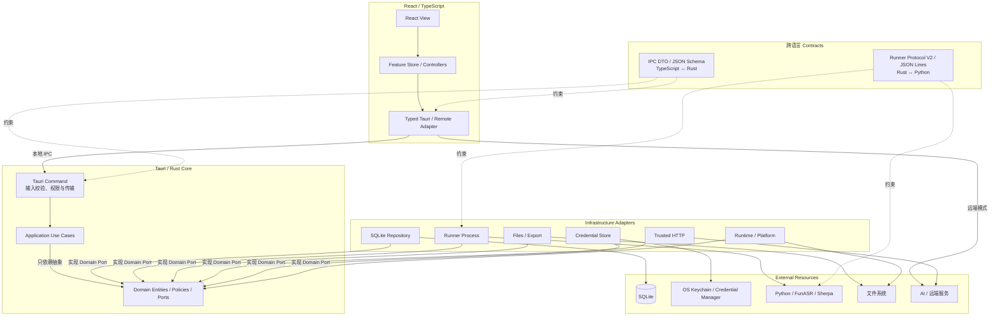
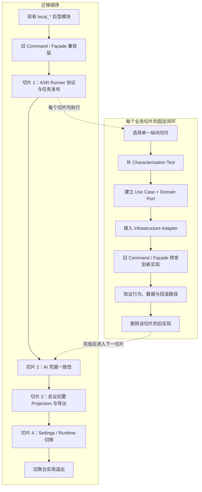
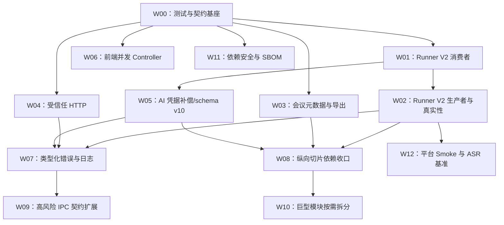

# Liberty 企业级代码库综合审查与整改方案

文档类型：评审  
状态：已完成并复核（代码整改完成，外部验收仍有阻塞）  
创建日期：2026-08-12  
最后核实：2026-08-13  
适用范围：Liberty `main` 分支提交 `16a74716e433ed4b38f9ba9af38bbfdb5dfe4b60` 及其当前未提交整改工作树；React/TypeScript 前端、Tauri/Rust/SQLite 本地后端、Python ASR Runner、托管运行时、CI 与发布供应链  
权威边界：本文是当前代码库的评审快照，可证明审查时看到的实现、静态结构与本次实际执行的检查结果；不替代产品需求、正式架构契约、安全渗透测试、隐私合规评估、真实音频质量基准、Windows/macOS 全平台验收或发布结论  
依据：当前源码、配置、锁文件、测试、GitHub Actions 工作流、运行时清单、`README.zh-CN.md`、`docs/architecture/`、`AGENTS.md` 与本次本地质量门禁结果  

实施入口：[Liberty 企业级整改可执行实施计划](../plans/2026-08-12-enterprise-remediation-implementation-plan.md)。第 3–12 节保留 2026-08-12 的基线评审事实、风险与整改设计；当前关闭状态以第 1.3 节复核矩阵为准，稳定架构约束以 `docs/architecture/enterprise-desktop-architecture.md` 为准。  

## 1. 执行摘要

### 1.1 整改前总体判断（基线）

Liberty 已经越过“原型项目”阶段，具备较强的本地数据可靠性、任务恢复、安全边界和发布供应链基础，但尚未达到可以低成本持续扩展的企业级代码库状态。

整改前成熟度呈明显的“中间强、两端弱”特征：

- Rust/SQLite 核心在任务 fence、lease、心跳、恢复、迁移、事务和文件边界方面明显强于一般桌面应用。
- CI、运行时哈希锁、不可变资产 URL、最小 Tauri capability 和 Release 原子发布设计较成熟。
- 业务架构迁移只完成了目录和部分 repository，`application`/`domain` 尚未真正成为依赖方向的中心。
- 前端和 Python Runner 的自动化测试、静态检查及协议治理显著弱于 Rust。
- ASR 在“请求说话人分离但实际没有分离结果”时会伪造 `Speaker 1`，属于会污染会议纪要内容的业务正确性问题，应先于重构处理。

基线综合评分为 **6.6 / 10**。这不是代码“差”，而是已经具备一批高质量基础设施，但质量分布不均，关键业务契约和维护边界尚未完成收口。该分数保留为整改前基线，不因本次实现直接改写；真实三平台与 ASR 证据完成后再进行下一轮独立评分。

### 1.2 整改前必须优先处理的结论

1. **P0：禁止伪造说话人分离成功。** FunASR 无说话人标签时和 Sherpa-ONNX 路径都会构造 `Speaker 1`，随后仍把任务标记为完成；这会直接污染按人员生成的会议纪要。
2. **P1：统一受信任 HTTP 目标策略。** 远端会议接口已有 HTTPS、禁重定向和 SSRF/DNS rebinding 防护，AI 模型接口却只验证非空后携带 API Key 与逐字稿发起请求。
3. **P1：移除导出中的组织专属固定值。** 会议时间、地点、主持人被固定为 `9:00`、`小会议室`、`冯吉琼`，与 Liberty 面向普通用户的产品职责冲突。
4. **P1：补齐前端与 Python Runner 测试。** 当前 Rust 有 149 个通过的单元测试，但前端关键并发 store 和 Python 协议层没有自动化测试门禁。
5. **P1：建立跨层契约单一事实来源。** Rust、TypeScript、Python 三端 DTO 主要靠手工镜像，空的 `packages/shared-types/` 没有承担契约职责。
6. **P2：按业务切片完成架构迁移。** 不做一次性大重构；以 ASR 任务、AI 总结、导出、设置等纵向切片逐步建立 command → use case → domain/port → infrastructure 的依赖方向。

### 1.3 2026-08-13 整改后复核

整改代码已经关闭原评审中可由仓库内实现和自动化证明的主要缺口，但尚未取得真实三平台低配设备和受控媒体证据，因此结论是“工程整改可执行且自动化闭环已建立”，不是“产品级全平台验收完成”。

| 原风险 | 当前状态 | 复核证据 | 剩余风险 |
| --- | --- | --- | --- |
| `LBT-R01` 伪造说话人 | 已关闭 | Runner V2、`domain/asr.rs` 不变量、Python/Rust fixture、UI/AI/导出降级链路 | 真实模型与三平台表现由 `W12` 验证 |
| `LBT-R02` AI HTTP 目标 | 已关闭 | `infrastructure/network/trusted_http.rs` 统一公网 HTTPS、loopback、DNS/IP、userinfo/query/fragment 策略 | 在线 provider 真请求未执行 |
| `LBT-R03` 固定会议字段 | 已关闭 | `domain/meeting_minutes.rs`、projection 与导出测试统一权威顺序 | 用户编辑入口仍是未来产品功能 |
| `LBT-R04` 凭据补偿 | 已关闭 | save/delete application use case、staged credential 与失败恢复测试 | Windows Credential Manager 实机仍随平台 smoke 验收 |
| `LBT-R05/R06` 契约与测试 | 已关闭 | 5 份 schema 生成物；前端 24、Python 11、Rust 179 项测试进入门禁 | 真实媒体不进入普通 CI |
| `LBT-R07/R08/R09` 分层与巨型模块 | 已关闭本轮范围 | application/domain/infrastructure 切片、前端 Controller、热点职责拆分 | 非热点模块只在实际变化时继续拆分，不追求一次性搬家 |
| `LBT-R10/R13` 错误与 i18n | 已关闭本轮高风险路径 | 类型化 `AppError`、transport 映射及中英文状态/错误消息 | 新增 command 仍需持续遵守门禁 |
| `LBT-R11/R12` 日志与原子文件 | 已关闭 | 脱敏轮转日志、JSON Lines 校验、原子 progress/result 与 revision 测试 | 真实长时运行日志容量随平台 smoke 观察 |
| `LBT-R14` 供应链 | 代码与 CI 已关闭；本机实扫阻塞 | `deny.toml`、固定扫描器及校验和、阻断夹具、Dependabot、894 组件 SBOM、Release 资产校验 | 当前 Mac 未安装扫描器；不能宣称本机漏洞/许可证实扫通过 |
| 低配 ASR/平台验收 | 阻塞 | manifest、阈值、benchmark、smoke、证据聚合和篡改阻断均可执行 | 缺 Apple Silicon/Intel/Windows x64 三类 8 GiB 实机、受控媒体与人工标注 |

FunASR 继续作为默认本地引擎。当前没有证据支持切换到 VibeVoice 或其他候选；基准框架不会自动修改默认配置。

## 2. 审查口径与覆盖范围

### 2.1 源码规模

本次按 Rust、TypeScript、TSX、Python、MJS 和 CSS 统计，共审查 **196 个源码文件、67,535 行**：

| 语言 | 文件数 | 行数 |
| --- | ---: | ---: |
| Rust | 81 | 34,913 |
| TypeScript | 44 | 9,320 |
| TSX | 31 | 10,316 |
| Python | 4 | 878 |
| MJS | 14 | 2,761 |
| CSS | 22 | 9,347 |

统计不等同于逐行形式化验证；评审重点覆盖了入口、业务主链路、状态机、数据库、跨进程协议、凭据、网络、导出、安全配置、测试和发布脚本。

### 2.2 已实际执行的验证

下表记录 2026-08-13 整改后的当前工作树复核结果；原始评审时的 149 项 Rust 测试已增长为 179 项。

| 检查 | 结果 | 能证明什么 |
| --- | --- | --- |
| `pnpm check:fast` | 通过 | 5 个契约生成物无漂移；TypeScript、Rust fmt、前端 9 文件/24 测试、Python Ruff/11 测试和 Rust 179 测试通过 |
| `CARGO_TARGET_DIR=<临时目录> cargo test --workspace --locked` | 通过，179 passed | 隔离外置磁盘 Cargo 缓存影响后的 Rust workspace 测试通过 |
| `pnpm desktop:build:web` | 通过 | 486 个模块完成生产构建；仅有既有 chunk-size warning |
| `pnpm rust:clippy` | 通过 | 当前平台 workspace/all-targets 在 warnings-as-errors 下通过 |
| `pnpm release:check` | 通过 | 版本、平台矩阵、安全基线、3 平台运行时哈希锁及 W11/W12 阻断夹具通过 |
| `node scripts/test-release-checks.mjs` | 通过 | 发布检查脚本自测通过；256 MiB 流式哈希峰值 RSS 126.2 MiB |
| 临时输出执行 `scripts/generate-sbom.mjs` | 通过 | CycloneDX 1.5 SBOM 包含 894 组件：Cargo 577、npm 248、PyPI 69 |
| `pnpm security:check` / `pnpm licenses:check` | 阻塞，退出码 2 | 本机缺固定版本 `cargo-deny`；CI 已配置安装校验后阻断执行，不能把未运行当通过 |
| `pnpm asr:fixtures:check` / `pnpm asr:evidence:check` | 阻塞，退出码 1 | 缺本地媒体清单和三平台正式证据时门禁会明确拒绝 |

未执行完整 Tauri 桌面打包、安装器、签名、公证、Windows x64 实机、macOS Intel 实机、三平台 8 GiB 真实 ASR 基准、在线 AI 请求或安全渗透测试。当前本机也没有完成漏洞/许可证实际扫描。上述项目均不能据本文宣称“已验证”。

## 3. 成熟度评分

评分是基于当前实现和 Liberty“本地优先、普通电脑可用、面向普通用户”的目标做出的工程判断，不是行业认证。

| 维度 | 评分 | 判断 |
| --- | ---: | --- |
| 业务正确性与契约 | 5.0 | 关键结果链路有恢复与校验，但说话人伪成功和导出固定值会污染用户结果 |
| Rust/SQLite 可靠性 | 8.2 | fence、lease、事务、WAL、迁移备份、删除恢复和原子导出较成熟 |
| 架构边界 | 5.0 | 已有目标目录，但 use case/domain 尚未接管依赖方向，旧聚合模块仍是事实中心 |
| 代码质量与可读性 | 6.3 | strict TS、Clippy 与相邻 Rust 测试较好，但巨型模块、字符串错误和职责混杂明显 |
| 自动化测试 | 5.5 | Rust 测试有质量；前端、Python 和跨进程契约基本空白 |
| 安全与隐私 | 7.0 | capability、路径、凭据和远端网络防护较强；AI URL、日志治理和依赖审计仍缺口明显 |
| 工程化与发布 | 8.4 | 固定工具链、固定 Action SHA、平台矩阵和原子 Release 流程是项目优势 |
| 可观测性与诊断 | 5.2 | 有持久化事件和诊断导出，但日志缺少统一事件模型、脱敏、级别和轮转 |
| 企业级可维护性 | 5.6 | 能继续迭代，但高频改动会集中碰撞少数大文件，跨语言变更成本偏高 |
| 低配置产品适配 | 6.7 | 本地优先和可管理运行时方向正确；Python/PyTorch 体积与说话人能力降级仍需治理 |

## 4. 已确认的工程优势

这些能力不应在整改中被推翻，应作为新架构的基础继续保留。

### 4.1 长任务可靠性

- `apps/desktop/src-tauri/src/local_jobs.rs:42` 开始的 `JobRunStore` 适配把持久化运行状态、attempt、lease、PID、进程身份和心跳接入调度器。
- `apps/desktop/src-tauri/src/infrastructure/job_scheduler.rs` 已覆盖并发限制、同任务互斥、恢复前终止旧进程、删除 fence、重试预算和 shutdown。
- 任务完成判断不只依赖文本日志；SQLite 运行快照与 `job_events` 承担事实来源。

### 4.2 SQLite 与迁移

- `apps/desktop/src-tauri/src/local_db.rs:83` 为每个连接设置 busy timeout、WAL、外键与同步策略。
- `apps/desktop/src-tauri/src/infrastructure/migrations.rs:116` 对系统凭据迁移使用 stage → publish → finalize/rollback，并处理“提交结果不确定”的恢复判断。
- 测试覆盖未来版本拒绝、重复启动、真实数据库备份、凭据失败后可重试等高风险场景。

### 4.3 运行时与供应链防护

- `apps/desktop/src-tauri/resources/runtime-manifest.json:1` 固定 Python、ffmpeg、模型集合、平台、下载 URL 与 SHA-256。
- `apps/desktop/src-tauri/src/local_runtime/archive.rs:19` 限制归档条目数、单文件大小和总展开大小，并校验路径穿越与链接。
- 运行时安装使用 generation 隔离；下载后校验哈希再发布，不复用未经校验的缓存。
- Python 依赖为 3 个支持平台维护哈希锁，Release 检查会验证锁文件。

### 4.4 安全边界

- 远端会议目标在 `apps/desktop/src-tauri/src/local_remote.rs:209` 建立独立客户端，禁重定向、禁代理、限制明文 HTTP、解析 DNS 后拒绝私网/链路本地/混合地址。
- API Token 和 AI API Key 使用 macOS Keychain / Windows Credential Manager，SQLite 只保存引用。
- `apps/desktop/src-tauri/src/window_scope.rs:63` 将独立任务窗口权限绑定到窗口、job 和随机 token。
- `apps/desktop/src-tauri/capabilities/` 按窗口分配最小 command capability；`scripts/check-security-baseline.mjs` 自动核对 command 注册与 capability。
- 文件输出、任务目录、归档解压和符号链接均有 containment/原子替换类防护。

### 4.5 CI 与发布

- `.github/workflows/quality.yml:67` 依次执行 TypeScript 类型检查、Rust fmt/test/Clippy、Release 检查和脚本自测。
- `.github/workflows/quality.yml:88` 对 Windows x64/x86 做编译检查。
- GitHub Actions 使用固定 commit SHA；Release 工作流区分只读准备、草稿预留、构建和发布，并验证精确 Release ID 与资产。

## 5. P0：业务正确性阻断项

### LBT-R01 请求说话人分离时会伪造 `Speaker 1`

**事实证据**

- `python/funasr-runner/runner.py:233`：FunASR sentence item 没有 speaker 字段且 `with_speaker=true` 时直接填入 `Speaker 1`。
- `python/funasr-runner/runner.py:239`：只要有逐字稿但没有任何说话人结果，就把全部 segment 补成 `Speaker 1`。
- `python/funasr-runner/runner.py:336`：Sherpa-ONNX 当前只生成整段逐字稿；请求说话人时固定创建一个 `Speaker 1`。
- `python/funasr-runner/runner.py:367` 虽在进度文案中说明“暂不做真实说话人分离”，但 `runner.py:376` 将 `failureReason` 设为空，`runner.py:379` 又把任务标记为 completed。
- `apps/desktop/src-tauri/src/local_ai/prompt.rs:8` 要求 AI 为每个 transcript speaker 生成独立报告，因此伪标签会继续进入纪要生成和导出。

**影响**

- 多人会议会被错误投影成一个人的发言，属于结果真实性问题，而不是展示瑕疵。
- 用户看见“任务完成”会合理理解为说话人分离已完成，当前状态语义与真实能力不一致。
- 后续成员匹配、个人周报、行动项归属和 Word 导出都会继承错误。

**根因**

- Runner 协议只有 `speakerSegments` 和 `failureReason`，没有区分“用户请求的能力”“引擎实际支持的能力”“本次实际得到的能力”。
- 代码把“保持输出 schema 完整”误等同于“可以制造默认业务值”。

**整改方案**

1. 将 Runner 结果升级为版本化协议，至少增加：
   - `protocolVersion`
   - `asrBackend`
   - `diarizationRequested`
   - `diarizationStatus: disabled | completed | unavailable | failed`
   - `warnings[]`
2. 没有真实标签时保持 `speakerSegments=[]`，绝不制造 `Speaker 1`。
3. 转写可继续成功，但状态必须是“转写完成、说话人分离不可用”；按人总结入口禁用或要求用户先手工标注。
4. Rust 解析层拒绝矛盾状态，例如 `diarizationStatus=completed` 但没有有效 speaker label。
5. UI 明确展示能力降级，导出不得把降级结果当成真实人员。

**验收标准**

- FunASR 无 speaker 字段、Sherpa-ONNX、用户关闭说话人分离、真实多说话人结果四类 fixture 均有 Python 协议测试和 Rust 消费测试。
- 当请求说话人但引擎不可用时，任务可保留逐字稿，但数据库、UI、AI prompt 和导出中不存在伪造的 `Speaker 1`。
- 用户能看见稳定错误码/告警，而不是只从自由文本进度推断降级。

## 6. P1：下一版本应完成的高优先级整改

### LBT-R02 AI 模型接口缺少受信任目标策略

**事实证据**

- `apps/desktop/src/features/models/views/ModelEditorView.tsx:114` 只检查名称、Base URL、API Key 和模型非空。
- `apps/desktop/src-tauri/src/local_ai/client.rs:22` 只做字符串裁剪和非空判断，随后在 `client.rs:141` 携带 Bearer API Key 与逐字稿请求该地址。
- 对比之下，`apps/desktop/src-tauri/src/local_remote.rs:209` 已实现 HTTPS、禁重定向、禁代理、DNS 固定和目标 IP 校验。

**影响**

- 配置错误或恶意导入的模型配置可把 API Key 和会议逐字稿发送到不可信地址。
- 公网明文 HTTP、私网服务、metadata 地址、带凭据 URL、重定向行为没有统一产品策略。

**整改方案**

- 抽取 `TrustedHttpTargetPolicy`，供远端会议和 AI provider 共同使用，但按用途配置策略：
  - 公网 provider 只允许 HTTPS；
  - 本地模型服务仅允许 loopback 字面量 HTTP；
  - 禁止 URL 内嵌账号密码，移除 query/fragment；
  - 默认禁重定向和系统代理；
  - DNS 解析后拒绝私网、链路本地、metadata 和混合答案；
  - 错误消息不回显 API Key、prompt 或完整响应体。
- 如果未来确需局域网 AI 服务，使用显式“允许的局域网端点”高级开关，不默认为普通用户开放。

**验收标准**

- 复用一套目标解析测试矩阵覆盖 HTTPS、公网 IP、loopback HTTP、私网、IPv6、userinfo、重定向和 DNS rebinding。
- 发起请求前完成校验；失败时没有任何网络连接和凭据发送。

### LBT-R03 导出层硬编码会议时间、地点和主持人

**事实证据**

- `apps/desktop/src-tauri/src/local_export.rs:28` 固定 `9:00`、`小会议室`、`冯吉琼`。
- `local_export.rs:165` 在生成持久化 `MeetingMinutesPayload` 时覆盖这些字段。
- `local_export.rs:192` 从已保存 payload 导出时再次覆盖时间、地点和主持人，用户或 AI 提供的数据也无法成为权威值。
- 现有测试明确断言固定值，因此这是当前受测试保护的行为，不是偶然残留。

**影响**

- 对面向普通用户的 Liberty，这是跨用户的数据污染和组织信息泄漏风险。
- 同一份 payload 在 UI 和导出中的权威字段不一致，难以建立稳定契约。

**整改方案**

- 权威顺序锁定为：`schemaVersion=2` 且 `meetingInfoSource=user` 的已持久化 `MeetingMinutesPayload.meetingInfo` > 当前 AI summary 可验证解析值 > 空值；渲染层对空值显示“待补充”，不把占位词写回 payload。
- 删除固定值及二次覆盖逻辑；现有 `MeetingMinutesInfo` 已覆盖所需字段，首期不新增数据库列。
- 新 payload 使用 `schemaVersion=2` 和 `meetingInfoSource: user | ai | empty`。当前尚无用户保存会议字段的入口，因此首期只生成 `ai` 或 `empty`；历史 v1 payload 不批量改写，只有时间、地点、主持人同时精确匹配旧固定三元组时，projection/export 才视为不可信并记录告警，原始 JSON 保留。

**验收标准**

- 新用户环境中不出现任何开发者或特定组织人名。
- payload、预览和 DOCX 使用同一份会议元数据权威来源。
- 添加空值、用户编辑、AI 提取、旧 payload 四组契约测试。

### LBT-R04 AI 模型凭据写入缺少跨存储补偿

**事实证据**

- `apps/desktop/src-tauri/src/infrastructure/repositories/ai_models.rs:185` 在数据库 upsert 前直接覆盖或删除系统凭据。
- 如果后续 SQL 或 transaction commit 失败，旧数据库记录可能指向已被覆盖/删除的凭据。
- `ai_models.rs:256` 删除模型时先删除数据库记录，再删除系统凭据；凭据删除失败会留下无法从数据库定位的孤儿凭据。
- 设置模块已经在 `apps/desktop/src-tauri/src/infrastructure/repositories/settings.rs:402` 实现 staged reference、finalize 和 rollback，可作为成熟模板。

**整改方案**

- AI 模型凭据也使用唯一 staged reference；数据库成功提交后再清理旧引用。
- 对提交结果不确定、凭据清理失败、删除重试和进程中断建立可恢复状态。
- 删除操作先记录 delete intent，再删除数据库映射并幂等清理凭据，避免“返回失败但模型已消失”的语义。

**验收标准**

- 覆盖 Keychain 写失败、SQL 失败、commit 失败、旧凭据清理失败、重复删除和应用重启恢复。
- 任一失败点后都能确定当前有效 credential reference，且不会把旧模型变成无凭据状态。

### LBT-R05 跨语言 DTO 和 Runner 协议没有单一事实来源

**事实证据**

- `apps/desktop/src/shared/types/meeting.ts` 共 818 行，混合会议、AI、运行时、设置、宠物、农场和诊断类型。
- Rust DTO 分散在 `local_db/model.rs`、各 command 模块和 Runner 解析结构中，与 TypeScript 靠人工保持一致。
- `packages/shared-types/` 目录为空，没有生成物、schema 或校验脚本。
- Python 通过文件 JSON 输出，协议变更没有 schema 版本或独立兼容测试。

**整改方案**

- 将 IPC/文件协议与内部 domain model 分离，以版本化 JSON Schema 作为唯一事实来源。
- 首期只覆盖 Runner V2 的 result、progress 和 stdout event：Rust 使用 `typify` 编译生成类型，TypeScript 使用 `json-schema-to-typescript` 生成只读类型，Python pytest 使用同一 schema 验证 fixture 和输出。
- Runner V2 消费者先上线并兼容 V1 一个稳定发布周期，再切换 Python 生产者；后续按 meeting、settings、ai、runtime 扩展高风险 IPC schema。
- 按域拆分 `meeting.ts`：meeting、ai、runtime、settings、pet、farm、diagnostics；只导出稳定 DTO。
- CI 添加生成物无漂移和 Runner fixture 双向解析测试；具体路径与命令见可执行实施计划。

**验收标准**

- 新增/重命名 DTO 字段只需修改一个权威源，CI 能检测任何一端未同步。
- 至少保留当前版本和前一版本 Runner fixture，明确兼容或拒绝策略。

### LBT-R06 前端和 Python Runner 缺少自动化质量门禁

**事实证据**

- `apps/desktop/package.json:7` 只有 Vite、TypeScript typecheck/build，没有 Vitest/Jest/Playwright、ESLint 或格式门禁。
- 当前仓库没有已跟踪的前端 `*.test.ts(x)` / `*.spec.ts(x)`。
- `python/funasr-runner/` 只有运行代码和依赖锁，没有 pytest、Ruff、类型检查或协议集成测试。
- `.github/workflows/quality.yml:67` 的行为测试集中在 Rust。

**影响**

- `useMeetingStore` 的 fence、轮询、远端握手和设置写队列主要靠人工推理，回归成本高。
- Runner 的伪说话人、原子写入和后端差异无法在 CI 中被提前发现。

**整改方案**

- 前端先加 Vitest，不追求页面快照覆盖率，优先测纯 application policy、store 并发时序和 service adapter。
- Python 先加 pytest + Ruff；类型检查可在协议 DTO 稳定后再引入。
- 添加 Rust 启动 Runner fixture 的跨进程契约测试，不依赖真实大模型下载。
- 覆盖率只作为趋势，不以统一百分比替代风险测试；首期门禁要求新增/修改关键逻辑必须有测试。

**验收标准**

- 前端至少覆盖 stale response、模式切换、删除/重试竞态、settings revision 冲突和 polling 生命周期。
- Python 至少覆盖 segment 提取、能力降级、异常结果、原子 JSON、stdout 协议纯净度。
- CI 能在不下载 ASR 模型的情况下完成全部契约测试。

## 7. P2：结构与长期维护整改

### LBT-R07 分层目录已经出现，但依赖方向尚未落地

**事实证据**

- `apps/desktop/src-tauri/src/application/mod.rs` 只有目标说明，没有实际 use case。
- `apps/desktop/src-tauri/src/domain/job.rs:1` 仍以 `allow(dead_code)` 保留尚未接入的状态类型。
- `local_jobs.rs`、`local_runtime.rs`、`local_db.rs` 同时承担 command、业务编排、进程/文件、SQL 门面和 DTO 责任。
- `infrastructure/runner_process.rs:14` 等基础设施模块反向依赖 `local_db` 的模型与 `LocalResult<String>`。

**整改原则**

- 不做目录搬家式重构，也不一次性重写所有模块。
- 每次选择一个有业务价值的纵向切片，先写 characterization test，再建立端口和 use case，最后让旧 command 变成兼容适配器。
- domain 不依赖 Tauri、rusqlite、reqwest、文件路径或 `local_db`；infrastructure 依赖 domain port，而不是反向依赖 command/数据库聚合模块。

**目标分层架构图（建议态，不代表当前实现）**

架构约束：业务依赖只能指向内层；`application` 通过 domain port 编排能力，`infrastructure` 实现 port。Tauri command 只承担传输边界职责，跨 TypeScript、Rust、Python 的字段与错误语义由显式契约约束。

**渐进式迁移架构图（Strangler / 兼容层模式）**

迁移期间旧 command / façade 保持对前端的兼容契约，新旧实现不长期双写。一个切片只有在行为测试、数据一致性和回滚路径通过，并删除对应旧实现后，才算完成；避免一次性重写带来的回归与长期双轨维护。

**第一批迁移切片**

1. ASR Runner 协议与任务完成发布。
2. AI 模型保存及凭据一致性。
3. 会议纪要 projection 与导出。
4. 设置保存和运行时 source 切换。

### LBT-R08 `useMeetingStore` 是前端高风险聚合点

**事实证据**

- `apps/desktop/src/features/meeting/stores/useMeetingStore.ts` 共 1,324 行。
- `useMeetingStore.ts:109` 开始维护模块级全局状态、listeners、服务实例、请求序列、读写 generation、远端握手 promise/timer、设置写队列和多个 polling scheduler。
- 同一模块同时负责本地/远端模式、任务 CRUD、hydration、竞态 fence、运行时安装、设置合并、外观和宠物奖励副作用。

**整改方案**

- 保留 `useSyncExternalStore` 选择，不为拆分而引入第二套状态框架。
- 提取可独立测试的 controller：`JobQueryController`、`RemoteCapabilitySession`、`RuntimeInstallController`、`SettingsSaveCoordinator`。
- Store 只负责组合 snapshot/actions；副作用由 controller 通过显式接口注入。
- 现有 `application/jobSnapshots.ts`、`polling.ts`、`settingsPolicy.ts` 是正确方向，应继续扩展，不建立新的 `shared/utils`。

**验收标准**

- 每个 controller 不依赖 React，可使用 fake clock 和 fake service 做确定性测试。
- Store 不再直接持有远端 retry timer、settings save queue 和全部 job fence 状态。
- 模式切换与 stale response 测试在重构前后行为一致。

### LBT-R09 巨型模块增加冲突面和认知成本

当前主要热点：

| 文件 | 行数 | 建议拆分轴 |
| --- | ---: | --- |
| `infrastructure/repositories/pet_store.rs` | 2,949 | catalog、wallet、inventory、purchase、gift box、milestone |
| `local_runtime.rs` | 2,382 | application use case、component state、acquire、publish、validation |
| `local_db.rs` | 1,731 | connection factory、repository facade、transaction use case |
| `infrastructure/repositories/ai_summary_runs.rs` | 1,458 | execution、chunk lease、projection、retention |
| `local_export.rs` | 1,355 | projection、speaker resolution、template mapping、command |
| `useMeetingStore.ts` | 1,324 | job、remote、runtime、settings controllers |
| `local_db/schema.rs` | 1,237 | baseline schema、per-version migrations、seed |
| `infrastructure/job_scheduler.rs` | 1,193 | scheduler core、recovery、execution registry、tests |

文件大小是风险信号，不是单独的重构理由。只有当模块存在多个变化原因、无法独立测试或高频冲突时才拆分；同一事务内强耦合逻辑不应被强行分散。

### LBT-R10 错误类型以字符串为主，跨层语义不稳定

**事实证据**

- `local_db.rs:18`、`local_jobs.rs:36`、`system.rs:14` 分别定义或使用 `Result<T, String>`。
- 前端部分场景依赖字符串前缀，例如 `capability_unavailable`；多数错误缺少稳定 code、retryable、cause 和用户文案键。

**整改方案**

- domain/application 使用类型化 `AppError`，至少包含 `code`、`category`、`retryable`、`context` 和内部 source。
- Tauri 边界序列化为稳定 DTO；用户文案在前端 i18n 映射，不把中文字符串当协议。
- 日志记录内部 cause，UI 只显示脱敏且可操作的信息。

### LBT-R11 日志缺少统一结构、脱敏和生命周期

**事实证据**

- AI 请求错误在 `local_ai/client.rs:71` 直接 `eprintln!` Base URL、模型和 provider 响应错误。
- `local_ai/client.rs:396` 会把非空 provider HTTP response body 拼进用户错误。
- Python stdout/stderr 被原样追加到 `process.log`；桌面宠物日志会记录 bubble 文本。
- 当前 append-only 日志帮助诊断，但没有统一 level、event id、字段脱敏、大小轮转和保留期策略。

**整改方案**

- 建立结构化日志 facade，区分用户事件、诊断事件和审计事件。
- 默认对 token、URL query、用户路径、逐字稿、provider body 和宠物自定义文本脱敏或摘要化。
- 日志文件按大小轮转并设置本地保留上限；诊断导出必须二次脱敏。
- 持久化 job event 继续作为状态事实来源，日志不得重新承担状态机职责。

### LBT-R12 Runner JSON 写入不是原子的

**事实证据**

- `python/funasr-runner/runner.py:30` 使用 `Path.write_text` 直接覆盖 `progress.json` 和 `result.json`。
- Rust 会在任务运行期间读取 `progress.json`；进程崩溃或读写交错可能得到截断 JSON。
- `local_runtime.rs:1723` 已有临时文件、flush/sync、rename 的原子 JSON 写入思路，但 Python Runner 未复用同等协议保证。

**整改方案与验收**

- Python 写同目录唯一临时文件，flush + `os.fsync` 后 `os.replace`；必要时同步父目录。
- 写入内容包含 protocol version 和单调 revision，消费者可忽略旧 revision。
- 用并发读写、写入中断和残留临时文件测试证明读取方只看到旧完整值或新完整值。

### LBT-R13 国际化边界不完整

- 前端已有类型化 `zh-CN`/`en-US` messages，这是优点。
- 但 store、Rust command、Runner 中仍有大量直接中文用户错误和状态文案；如果错误字符串继续作为跨层协议，英文界面无法稳定本地化。
- 整改应与类型化错误同步：底层返回 code + parameters，UI 决定语言；仅开发诊断保留技术原文。

### LBT-R14 依赖安全和合规门禁缺失

本次未发现 `cargo-audit`/`cargo-deny`、OSV、许可证策略、SBOM、Dependabot/Renovate 等配置。现有固定 lock 与 SHA-256 能证明可重复性和资产完整性，但不能证明依赖不存在已知漏洞或许可证风险。

建议：

- PR/每日执行 Rust、Node、Python 漏洞扫描；在线漏洞库不可用时明确标记为 skipped，而不是假通过。
- 建立允许/拒绝许可证策略和第三方清单。
- Release 生成 CycloneDX 或 SPDX SBOM，与安装资产一同归档。
- 自动升级只创建 PR，不自动发布；运行时大依赖升级必须经过真实音频与资源基准。

## 8. 公共方法与抽象策略

### 8.1 不建立全局“工具抽屉”

公共方法的目标不是减少重复行数，而是让稳定业务不变量只有一个实现。禁止把所有可复用函数塞进 `utils.ts`、`helpers.rs` 或 `common.py`；这会隐藏依赖方向并形成新的巨型模块。

推荐按职责放置：

| 公共能力 | 归属 | 首批复用方 |
| --- | --- | --- |
| `TrustedHttpTargetPolicy` | Rust infrastructure/network | remote meeting、AI provider、未来运行时源 |
| `CredentialWritePlan` | Rust infrastructure/credentials | app settings、AI models |
| `AppError` / error DTO | Rust domain/application + transport mapper | 所有 command、前端 i18n |
| `RunnerProtocolV2` | contracts | Python writer、Rust reader、TS diagnostics |
| `AtomicJsonWriter` | Python Runner 内部基础设施 | progress、result、未来诊断快照 |
| `MeetingMinutesProjection` | Rust application/domain | AI summary、payload persistence、preview、DOCX |
| `Lease/Fence` 值对象 | Rust domain | ASR job、AI summary run、删除 intent |
| `PollingScheduler` | 前端 feature application | job、runtime polling |
| `RedactedDiagnosticEvent` | shared observability | runtime、AI、Runner、pet diagnostics |

### 8.2 抽象准入条件

一个公共抽象至少满足以下两项再提取：

1. 被两个独立业务路径使用；
2. 承载安全、事务、状态机或协议不变量；
3. 有独立测试矩阵；
4. 调用方变化频率低于实现方；
5. 名称能表达业务含义，而不是 `handleData`、`commonHelper`。

不建议提取：仅两三行的字符串处理、只出现一次的业务分支、为了减少文件行数而创建的转发层、把 rusqlite/tauri 类型包装后仍泄漏到 domain 的“伪端口”。

## 9. 目标测试金字塔

### 9.1 快速层：每个 PR 必跑

- TypeScript typecheck、ESLint、格式检查。
- 前端 application/store 单元测试，使用 fake timers 和 fake services。
- Python Ruff、pytest、Runner schema fixture。
- Rust fmt、Clippy、domain/repository 单元测试。
- 契约生成无漂移、runtime manifest、capability 与 Release policy 检查。

目标：普通 PR 10 分钟内给出主要反馈；重量级打包不阻塞最早反馈。

### 9.2 集成层：每个 PR 或合并队列

- 临时 SQLite 文件的迁移、恢复和事务失败注入。
- Rust 启动 fake Runner，验证 stdout、progress/result、取消、崩溃和 lease 失效。
- AI HTTP mock server 测目标策略、超时、重试、截断和错误脱敏。
- DOCX/XLSX 结构解析测试，不依赖肉眼判断文件非空。

### 9.3 平台层：合并 main / Release

- macOS Apple Silicon、macOS Intel、Windows x64 编译与 smoke test。
- Windows x86 当前应明确是“仅编译兼容”还是“产品支持”；运行时清单已写明不支持自助 ASR，不能把 cargo check 等同于产品支持。
- 安装、升级、旧数据库迁移、Keychain/Credential Manager、单实例和卸载后数据保留验收。

### 9.4 模型质量层：独立于普通代码 CI

- 建立脱敏的短会、长会、多人重叠、中文数字、英文夹杂、噪声和低配设备基准集。
- 指标同时包含 CER/WER、说话人 DER、峰值内存、安装体积、冷启动、每分钟处理耗时和失败率。
- 模型/运行时升级必须对比上一个生产版本，不能只证明“可以跑”。

## 10. ASR 技术路线建议

本节沿用本轮前序比较形成的产品约束，但未在本次代码审查中重新执行外部模型基准，因此属于建议，不是当前性能事实。

1. **默认本地引擎继续以 FunASR Paraformer 为主。** 它与当前中文会议、本地优先和低配置目标最一致，现有运行时与业务链路也围绕它建立。
2. **优先解耦 Python/PyTorch 运行时，而不是立即替换识别模型。** 下一阶段用真实基准评估更轻量的 FunASR 部署形态或完善 sherpa-onnx；只有准确率、说话人能力、内存和包体综合胜出才切默认。
3. **把 ASR 做成端口，不把某个模型写进业务状态机。** `AsrEngine` 应返回能力声明和版本化结果，FunASR、sherpa-onnx、未来远端引擎都遵守同一契约。
4. **VibeVoice/Qwen 类能力只作为可选远端增强候选。** 在未证明普通电脑可承受其包体、内存、耗时和稳定性前，不作为 Liberty 默认本地引擎。
5. **能力降级优先保证真实性。** 可以没有说话人分离，但不能伪造说话人分离成功。

## 11. 30/60/90 天整改路线

时间窗口从实际启动日计算；它是容量规划，不是固定人力下的交付承诺。工作包编号、P50 工程估算和逐项门禁见可执行实施计划。

### 0–30 天：先修真实性和安全边界

**目标：** 先建立门禁和兼容消费者，再关闭真实性与安全风险。

- 串行执行 `LBT-W00 测试与契约基座 -> W01 Runner V2 消费者与 schema v9 -> W02 Runner V2 生产者与真实性闭环`。
- `W00` 完成后可并行执行 `W03 会议元数据与导出`、`W04 受信任 HTTP`；`W01` 完成 schema v9 后，`W02 Runner V2 生产者` 与 `W05 AI 凭据补偿/schema v10` 可并行。
- 建议容量为 19–31 人日；容量不足时最低可发布集合为 `W00 + W01 + W02 + W03`，未完成的 `W04/W05` 继续保留为 P1 阻断项。

**里程碑验收：** 新结果不伪造 speaker，历史结果显式标为 `legacy_unverified`；新导出无组织专属固定值；已完成工作包的专项测试和 CI 门禁均通过。

### 31–60 天：收口契约和高频变化边界

**目标：** 收口跨层语义和高频变化边界。

- 执行 `LBT-W06 前端并发 Controller`、`W07 类型化错误/i18n/日志`、`W08 纵向切片依赖收口`。
- 建议容量为 17–27 人日；`W07` 必须等待 Runner、HTTP、凭据三个高风险切片完成，`W08` 必须等待 ASR、凭据和会议纪要切片完成。

**里程碑验收：** store 并发行为可由 fake service/fake timer 确定性验证；高风险错误稳定且可双语展示；四个首批 use case 可脱离 WebView 测试。

### 61–90 天：完成可持续治理

**目标：** 形成可持续契约、模块和供应链治理。

- 执行 `LBT-W09 高风险 IPC 契约扩展`、`W10 巨型模块按变化原因拆分`、`W11 依赖安全/许可证/SBOM`、`W12 平台 Smoke 与 ASR 基准`。
- 建议容量为 20–36 人日，不含跨平台硬件排队和真实模型下载。

**里程碑验收：** 高风险 IPC 由版本化 schema 管理；巨型模块不产生新双写；Release 附带依赖清单；主要平台具备可审计 smoke 和模型基准记录。

## 12. 建议的整改顺序与依赖

不建议先进行全仓目录调整。`W01` 必须采用消费者先行兼容，`W02` 才切换 Runner 生产者；没有测试和契约护栏时，大规模搬家会增加回归概率，却不会自动改善业务正确性。

## 13. 完成定义

本整改计划不能以“文件已拆分”“命令退出 0”或“安装包能生成”作为最终完成。企业级完成标准应同时满足：

- **真实性：** 结果明确区分实际能力、降级和失败，不制造业务数据。
- **一致性：** SQLite、系统凭据、Runner 文件和导出 payload 在失败/重试后可收敛。
- **可测试：** 高风险状态机、协议和并发路径有确定性自动化测试。
- **可演进：** DTO 有单一事实来源，command 薄、use case 可脱离 WebView 测试。
- **可审计：** Release、依赖、运行时资产、日志和用户数据生命周期有记录和边界。
- **低配置友好：** 每次 ASR 运行时调整都有包体、内存、耗时和准确率的对照数据。

## 14. 结论

Liberty 当前最值得保留的是对本地数据、长任务恢复、安全文件边界和发布供应链的认真设计；最需要修正的是业务契约真实性和各层质量不均衡。

整改应遵循“先正确、再可测、后分层”的顺序：先关闭伪说话人与固定导出数据，再建立 Runner/IPC 契约和前端/Python 测试，最后按业务切片迁移架构。这样既能保护普通用户的低配置体验，也不会用一次性重构消耗现有可靠性资产。
