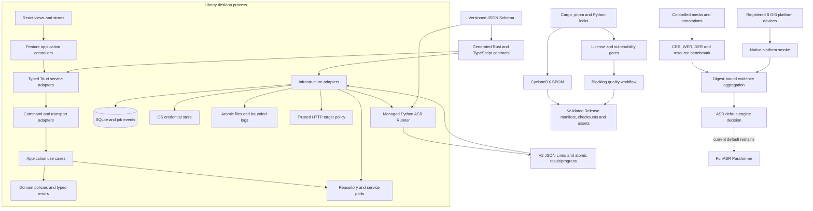

# Liberty Enterprise Desktop Architecture

Status: implemented architecture baseline; last verified 2026-08-13. Platform performance evidence remains governed separately and is not implied by this document.

## Scope

Liberty is a local-first desktop application for meeting media processing. The enterprise target is a maintainable, secure, testable desktop product that supports:

- macOS Apple Silicon: `aarch64-apple-darwin`, platform id `darwin-aarch64`
- macOS Intel: `x86_64-apple-darwin`, platform id `darwin-x64`
- Windows x64: `x86_64-pc-windows-msvc`, platform id `windows-x64`
- Windows x86: `i686-pc-windows-msvc`, platform id `windows-x86`

Windows x86 is a separately validated platform because Python runtime availability, memory pressure, and model performance differ from Windows x64.

## Target Layers

### Frontend

- `app`: application shell, router, bootstrapping, global providers.
- `features`: user-facing feature modules. Views should coordinate UI state, not own long-running workflows.
- `shared`: reusable components, typed clients, common services, i18n, styles, and types.
- `features/*/application`: frontend use cases that orchestrate stores, Tauri clients, and remote clients.

### Tauri Backend

- `commands`: Tauri command adapters. They validate transport inputs and call application services.
- `application`: use cases such as creating jobs, retrying jobs, installing runtime assets, and generating summaries.
- `domain`: entities, value objects, state machines, policies, and typed errors.
- `infrastructure`: SQLite repositories, file system access, Python runner integration, HTTP AI clients, OS services, and platform-specific implementations.

Command modules must not directly own SQL, child-process orchestration, or file-system policy. Infrastructure modules must not depend on Tauri window state unless the integration is explicitly OS-bound.

### Desktop WebView Policy

- `tauri.conf.json` is validated against the pinned Tauri 2 schema. The current schema has no `webFeatures.reload` or `webFeatures.contextMenu` fields, so unsupported keys must not be added to configuration.
- `webview_policy.rs` applies the no-browser-refresh and no-default-context-menu policy to every WebView, including windows created at runtime.
- macOS and Linux use document-start event interception. Windows additionally disables WebView2 default context menus and browser accelerator keys through its native settings API.
- Liberty has no browser reload entry point. A future user-visible recovery action must call a narrowly authorized Rust command and must not re-enable browser-owned refresh shortcuts.

### File Export Boundary

- React owns the save-dialog interaction and sends a typed export request; it does not write files or synthesize browser downloads.
- Local exports reload authoritative job data from SQLite in Rust. Remote text exports accept only the minimal read-only job projection already obtained from the remote service.
- Rust selects the verified transcript projection, renders localized transcript or Markdown content, validates the dialog-authorized path, rejects link traversal, and commits through a temporary file plus atomic replacement.
- DOCX and text exports share the same safe output implementation. Existing targets remain unchanged when rendering, synchronization, validation, or replacement fails.

## Executable Architecture

The diagram defines three independently failing flows:

- runtime flow: UI request → typed adapter → application/domain policy → infrastructure → durable state or external boundary;
- contract and supply-chain flow: schema/locks → generated contracts/scanners/SBOM → CI → Release assets;
- ASR evidence flow: controlled media plus registered devices → benchmark/smoke → digest-bound aggregation → explicit engine decision.

Passing one flow never implies another passed. In particular, a production web build does not prove the native client, a generated SBOM does not prove a vulnerability scan ran, and benchmark tooling does not replace physical-device evidence.

## Shared Code Extraction

Common helpers live under `infrastructure` when they touch runtime concerns such
as time, IDs, persistence, credentials, or platform-specific services. Feature
modules should call these helpers instead of redefining timestamp generation,
schema migration checks, or repository writes.

The second implementation pass starts this extraction with:

- shared timestamp and ID helpers
- reusable SQLite `ADD COLUMN IF MISSING` helper
- `job_events` repository
- Runner command construction isolated from job orchestration
- frontend diagnostics use case extracted out of the settings view

The third implementation pass continues the boundary split:

- AI summary-run persistence moved into `infrastructure/repositories/ai_summary_runs.rs`
- desktop-pet persistence moved into `infrastructure/repositories/pet.rs`
- Python runner process concerns moved into `infrastructure/runner_process.rs`
- frontend polling and job-snapshot merge rules moved into `features/meeting/application`
- `useMeetingStore` now coordinates use cases instead of owning polling mechanics

The fourth refinement pass reduces remaining large orchestration files:

- AI command adapters stay in `local_ai.rs`, while HTTP request policy, prompt
  construction, and response normalization live in `local_ai/*`
- managed-runtime commands stay in `local_runtime.rs`, while manifest loading,
  archive extraction, resource path resolution, logging, and process streaming
  live in `local_runtime/*`
- settings page state and runtime-panel calculations live in
  `features/settings/application`, leaving `SettingsView.tsx` focused on layout

The current pet and operations pass adds these user-facing feature modules and
repository boundaries:

- `features/pet-check-in`: daily check-in, 14-day reward calendar, history, and
  make-up ticket flow
- `features/pet-redeem-key`: local redeem-key entry and redemption history
- `infrastructure/repositories/pet_check_in.rs`: reward-cycle rules,
  check-in persistence, make-up window, and ticket consumption
- `infrastructure/repositories/pet_redeem_key.rs`: redeem-key normalization,
  HMAC/signature validation, reward granting, and duplicate prevention
- `commands/diagnostics.rs`: system diagnostics and desktop-pet diagnostic log
  export

## Data And Migration

- SQLite schema changes are versioned migrations, not ad hoc `ALTER TABLE` statements.
- `app_meta.schema_version` is the source of truth for the local database version.
- Repository modules own SQL and expose typed operations to application services.
- Migrations must be idempotent at the migration runner level and covered by upgrade tests.

## Job System

The enterprise job runner owns all long-running local work:

- queue state: `pending`, `running`, `completed`, `failed`, `cancelled`
- controls: create, retry, cancel, resume
- concurrency: controlled by user settings and platform limits
- persistence: job snapshots plus structured `job_events`
- process protocol: Python runner emits JSON lines for progress, result, and error events

Text logs are a user-facing projection of structured events, not the only source of operational truth.

Runner protocol V2 is defined under `packages/shared-types/schemas/runner/v2/` and is consumed by Rust-generated types while Python validates output against the same schema. Results distinguish ASR completion from diarization capability. Missing diarization stays `unavailable` or `failed` with an empty speaker projection; no layer may synthesize a default speaker label.

## Runtime Management

The managed runtime is acquired by the desktop client, not by a release workflow
that silently embeds opaque environment assets. `runtime-manifest.json` is the
source of truth for:

- runtime version and Python version
- supported platform IDs and ASR backend
- Python bundle URLs and executable candidates
- ffmpeg bundle URLs and executable candidates
- selectable download sources, pip indexes, and model endpoints

Settings exposes the Environment & Models flow. Users may choose a configured
download source or manually specify a Python path. Placeholder or missing asset
URLs must fail visibly during runtime installation instead of pretending a
source is usable.

## Security Baseline

- Tauri CSP is enabled for production builds.
- Capabilities are split by window role:
  - `main`: orchestration, dialogs, exports, and child-window creation
  - `ai-summary` / `meeting-notes`: read-only result windows
  - `model-editor` / `template-editor` / `member-editor`: edit windows
- File-system permissions use explicit scopes.
- API keys and remote tokens live in the system credential store:
  - macOS: Keychain
  - Windows: Credential Manager
- Logs and diagnostics redact tokens, API keys, and unnecessary local path details.

The implementation enables CSP, explicit file-system scopes, and per-window
capability files. File-system writes and child-window creation stay limited to
the main window; result and editor windows only receive the native window
permissions they actually use.

AI model records now store an `api_key_ref` and keep API keys in the system
credential store. Model listing hydrates secrets through the credential store,
save/update writes non-empty keys to the OS store, and deletion removes the
referenced secret. This keeps the public model configuration contract stable
without persisting plaintext API keys in SQLite.

AI model writes use a staged credential plan: stage the new secret, commit only its reference, then retire the old reference with retryable cleanup. AI and remote-meeting HTTP clients share a trusted-target policy; the policy runs before credentials or meeting content can be sent and rejects disallowed schemes, embedded credentials, redirects, unsafe DNS answers, private/link-local/metadata targets, and mixed public/private resolution according to the caller profile.

Runner and diagnostic logs use structured events, bounded length, redaction and rotation. Credentials, authorization headers, prompts, transcripts and user media paths are not accepted as ordinary diagnostic fields.

## Quality Gates

Every pull request and release build must run:

- generated-contract drift checks
- TypeScript type checking
- frontend unit tests
- Python Ruff and pytest
- frontend production build
- Rust formatting check
- Rust tests
- Rust clippy with warnings denied
- release version, platform, security-baseline and runtime-lock checks
- dependency-governance and ASR validation blocking fixtures

Release workflows run after quality workflows pass.

The supply-chain job installs checksum-pinned `cargo-deny 0.20.2` and OSV Scanner `2.5.0`, then enforces lock integrity, source, license and vulnerability policy. Scanner absence is a failure, not a skipped success. It generates a CycloneDX 1.5 SBOM from Cargo, pnpm and three supported Python runtime locks; Release assembly validates its application version, name, digest and absence of local paths or credential-like content before adding it to checksums and upload plans.

Local `pnpm security:check` and `pnpm licenses:check` require the same scanner prerequisites. Exit code `2` means the local toolchain is unavailable and must never be reported as a clean scan.

## ASR Evidence Gate

The executable specification lives in `benchmarks/asr/` and the corresponding `scripts/*asr*.mjs` tools. It keeps sensitive media, local manifests and accepted evidence outside version control while committing schemas, required scenarios, thresholds and platform definitions.

An ASR engine change needs all of the following from the same commit and runtime/model set:

- controlled media hashes and versioned human annotations for short, long, overlapping-speaker, noise, mixed Chinese/English and Chinese-number scenarios;
- benchmark results for baseline and candidate, including CER, WER, DER, failures, P95 real-time factor, peak RSS, CPU, cold start, elapsed time and installation size;
- native smoke attestations on macOS Apple Silicon 8 GiB, macOS Intel 8 GiB and Windows x64 8 GiB;
- successful digest and cross-platform consistency aggregation.

Missing media, annotations, smoke input, accepted evidence, required checks or exact 8 GiB performance-tier devices is `blocked`, not `passed`. Higher-memory machines may provide compatibility smoke only. Windows x86 remains compile-only for local ASR. FunASR remains the default until a separately reviewed candidate satisfies every threshold; the evidence scripts do not mutate product configuration.

## Release Matrix

Each supported platform gets:

- independent runtime manifest entries and platform-specific download metadata
- runtime asset reachability or checksum validation where assets are configured
- platform-specific smoke validation
- separate release artifact naming
- signing and notarization strategy where applicable

macOS artifacts must distinguish Apple Silicon and Intel builds. Windows x86
and x64 must never share runtime assumptions; Windows x86 may be present in the
platform matrix while client-side local ASR download remains unsupported.
